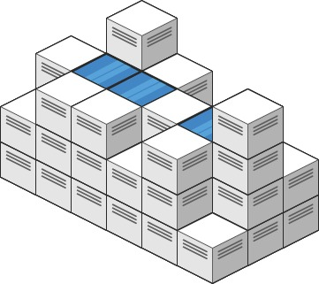

## [接雨水 II](https://leetcode.cn/problems/trapping-rain-water-ii/description/)

给你一个 m x n 的矩阵，其中的值均为非负整数，代表二维高度图每个单元的高度，请计算图中形状最多能接多少体积的雨水。



````
示例 1:
输入: heightMap = [[1,4,3,1,3,2],[3,2,1,3,2,4],[2,3,3,2,3,1]]
输出: 4
解释: 下雨后，雨水将会被上图蓝色的方块中。总的接雨水量为1+2+1=4。

示例 2:
输入: heightMap = [[3,3,3,3,3],[3,2,2,2,3],[3,2,1,2,3],[3,2,2,2,3],[3,3,3,3,3]]
输出: 10
````

提示:

- m == heightMap.length
- n == heightMap[i].length
- 1 <= m, n <= 200
- 0 <= heightMap[i][j] <= 2 * 10^4

### 解法：小根堆
时间复杂度：`O(mnlog(mn))`，空间复杂度：`O(mn)`
````java
class Solution {
    private static final int[][] DIRS = {{0, -1}, {0, 1}, {-1, 0}, {1, 0}};

    public int trapRainWater(int[][] heightMap) {
        int m = heightMap.length, n = heightMap[0].length;
        PriorityQueue<int[]> pq = new PriorityQueue<>((a, b) -> (a[0] - b[0]));
        for (int i = 0; i < m; i++) {
            for (int j = 0; j < n; j++) {
                if (i == 0 || i == m - 1 || j == 0 || j == n - 1) {
                    pq.add(new int[]{heightMap[i][j], i, j});
                    heightMap[i][j] = -1; // 标记 (i,j) 访问过
                }
            }
        }

        int ans = 0;
        while (!pq.isEmpty()) {
            int[] t = pq.poll(); // 去掉短板
            int minHeight = t[0], i = t[1], j = t[2]; // minHeight 是木桶的短板
            for (int[] d : DIRS) {
                int x = i + d[0], y = j + d[1]; // (i,j) 的邻居
                if (0 <= x && x < m && 0 <= y && y < n && heightMap[x][y] >= 0) { // (x,y) 没有访问过
                    // 如果 (x,y) 的高度小于 minHeight，那么接水量为 minHeight - heightMap[x][y]
                    ans += Math.max(minHeight - heightMap[x][y], 0);
                    // 给木桶新增一块高为 max(minHeight, heightMap[x][y]) 的木板
                    pq.add(new int[]{Math.max(minHeight, heightMap[x][y]), x, y});
                    heightMap[x][y] = -1; // 标记 (x,y) 访问过
                }
            }
        }
        return ans;
    }
}
````