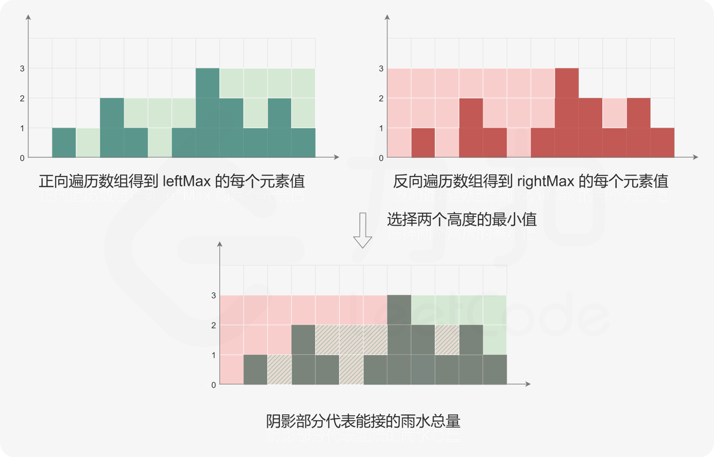

## [42. 接雨水](https://leetcode.cn/problems/trapping-rain-water/description/)

给定 n 个非负整数表示每个宽度为 1 的柱子的高度图，计算按此排列的柱子，下雨之后能接多少雨水。


````
示例 1：

输入：height = [0,1,0,2,1,0,1,3,2,1,2,1]
输出：6
解释：上面是由数组 [0,1,0,2,1,0,1,3,2,1,2,1] 表示的高度图，在这种情况下，可以接 6 个单位的雨水（蓝色部分表示雨水）。
示例 2：

输入：height = [4,2,0,3,2,5]
输出：9
````

提示：

- n == height.length
- 1 <= n <= 2 * 104
- 0 <= height[i] <= 10^5

### 解法一：动态规划 + 前后缀分解
1. 定义两个长度为 $n$ 的数组 $leftMax$ 和 $rightMax$。对于$ 0≤i<n$，$leftMax[i]$ 表示下标 $i$ 及其左边的位置中，$height$ 的最大高度，$rightMax[i]$ 表示下标 $i$ 及其右边的位置中，$height$ 的最大高度。
2. leftMax[0]=height[0]，rightMax[n−1]=height[n−1]。两个数组的其余元素的计算如下：
   - 当 $1≤i≤n−1$ 时，$leftMax[i]=max(leftMax[i−1],height[i])；$

   - 当 $0≤i≤n−2$ 时，$rightMax[i]=max(rightMax[i+1],height[i])。$

    因此可以正向遍历数组 $height$ 得到数组 $leftMax$ 的每个元素值，反向遍历数组 $height$ 得到数组 $rightMax$ 的每个元素值。

    在得到数组 $leftMax$ 和 $rightMax$ 的每个元素值之后，对于$ 0≤i<n$，下标 $i$ 处能接的雨水量等于 $min(leftMax[i],rightMax[i])−height[i]$。遍历每个下标位置即可得到能接的雨水总量。




时间复杂度：`O(n)`，空间复杂度：`O(n)`

````java
class Solution {
   public int trap(int[] height) {
      int n = height.length;
      int[] preMax = new int[n]; // preMax[i] 表示从 height[0] 到 height[i] 的最大值
      preMax[0] = height[0];
      for (int i = 1; i < n; i++) {
         preMax[i] = Math.max(preMax[i - 1], height[i]);
      }

      int[] sufMax = new int[n]; // sufMax[i] 表示从 height[i] 到 height[n-1] 的最大值
      sufMax[n - 1] = height[n - 1];
      for (int i = n - 2; i >= 0; i--) {
         sufMax[i] = Math.max(sufMax[i + 1], height[i]);
      }

      int ans = 0;
      for (int i = 0; i < n; i++) {
         ans += Math.min(preMax[i], sufMax[i]) - height[i]; // 累加每个水桶能接多少水
      }
      return ans;
   }
}
````

### 解法二：双指针
注意 while 循环可以不加等号，因为在「谁小移动谁」的规则下，相遇的位置一定是最高的柱子，这个柱子是无法接水的。

时间复杂度：`O(n)`，空间复杂度：`O(1)`
````java
class Solution {
   public int trap(int[] height) {
      int ans = 0;
      int left = 0;
      int right = height.length - 1;
      int preMax = 0; // 前缀最大值，随着左指针 left 的移动而更新
      int sufMax = 0; // 后缀最大值，随着右指针 right 的移动而更新
      while (left < right) {
         preMax = Math.max(preMax, height[left]);
         sufMax = Math.max(sufMax, height[right]);
         if (height[left] < height[right]) {
            ans += preMax - height[left];
            ++left;
         } else {
            ans += sufMax - height[right];
            --right;
         }
      }
      return ans;
   }
}
````

### 解法三：单调栈
这个方法可以总结成 16 个字：找上一个更大元素，在找的过程中填坑。

注意 while 中加了等号，这可以让栈中没有重复元素，从而在有很多重复元素的情况下，使用更少的空间。

时间复杂度：`O(n)`，空间复杂度：`O(n)`
````java
class Solution {
   public int trap(int[] height) {
      int ans = 0;
      Deque<Integer> stack = new ArrayDeque<>();
      for (int i = 0; i < height.length; i++) {
         while (!stack.isEmpty() && height[i] >= height[stack.peek()]) {
            int bottomH = height[stack.pop()];
            if (st.isEmpty()) {
               break;
            }
            int left = stack.peek();
            int currHeight = Math.min(height[left], height[i]) - bottomH; // 面积的高
            int currWidth = i - left - 1;
            ans += currHeight * currWidth;
         }
         stack.push(i);
      }
      return ans;
   }
}
````

