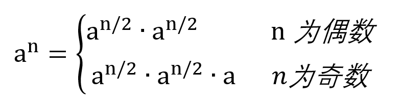

## [16. 数值的整数次方](https://leetcode.cn/problems/shu-zhi-de-zheng-shu-ci-fang-lcof/)
同:[50. Pow(x, n)](https://leetcode.cn/problems/powx-n/description/)

### 题目描述

实现函数 double Power(double base, int exponent)，求 base 的 exponent 次方。

不得使用库函数，同时不需要考虑大数问题。

**注意**：

- 不会出现底数和指数同为 0 的情况。

**样例 1**

```
输入：10 ，2

输出：100
```

**样例 2**

```
输入：10 ，-2

输出：0.01
```

注意判断值数是否小于 0。另外 0 的 0 次方没有意义，也需要考虑一下，看具体题目要求。

### 解法一

时间复杂度 `O(N)`。
超时！
```java
class Solution {

    /**
     * 计算数值的整数次方
     *
     * @param base 底数
     * @param exponent 指数
     * @return 数值的整数次方
     */
    public double Power(double base, int exponent) {
        if (exponent == 0) {
            return 1;
        }
        if (exponent == 1) {
            return base;
        }

        double res = 1;
        for (int i = 0; i < Math.abs(exponent); ++i) {//循环
            res *= base;
        }

        return exponent > 0 ? res : 1 / res;
    }
}
```

### 解法二



递归求解，每次 exponent 缩小一半，时间复杂度为 `O(log N)`。

````
x ^ 13
13 =  1   1   0   1
   = x^8 x^4 x^0 x^1
   
通过 x >> 1 来移动，然后通过 x & 1 判断是否有1。
等于1，res * x; 过程中x也是变大的，每一次移动 x = x ^ 2 = x * x;
````

### （记住）解法：帅地写法

```java
class Solution {
    /**
     * 计算数值的整数次方
     *
     * @param base 底数
     * @param exponent 指数
     * @return 数值的整数次方
     */
    public double myPow(double base, int exponent) {
        double res = 1;
        long y = exponent;//如果直接用会把exponent覆盖，影响最后负数判断，而且需要取绝对值才能正常操作
        if(y < 0) {
            y = -y;//long y = -exponent;//负数在负可能会超过int最大值，比如int exponent = -2147483648;-exponent =2147483648超过int最大值2147483647。 
            base = 1/base;
        }
        while(y != 0) {
            if(y % 2 == 1) { // (y & 1) == 1 存在就需要 res * base
                res = res * base;
            }
            base = base * base;// base逐渐变大，每移动一次base ^ 2 = base * base;
            y = y / 2;// y = y >> 1;
        }
        return res;
    }
}
```
