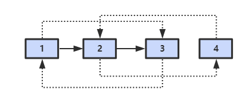
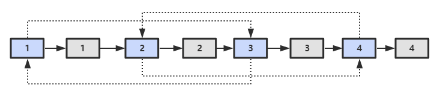
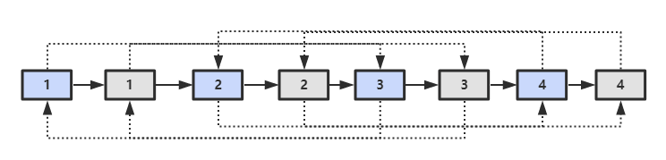
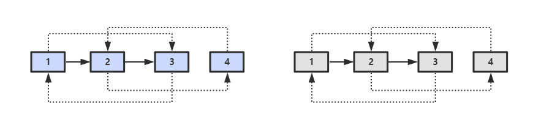

## [35. 复杂链表的复制](https://leetcode.cn/problems/fu-za-lian-biao-de-fu-zhi-lcof/)
同：[138. 随机链表的复制](https://leetcode.cn/problems/copy-list-with-random-pointer/description/)

### 题目描述

输入一个复杂链表（每个节点中有节点值，以及两个指针，一个指向下一个节点，另一个特殊指针指向任意一个节点），返回结果为复制后复杂链表的 `head`。（注意，输出结果中请不要返回参数中的节点引用，否则判题程序会直接返回空）



### 解法：复制 + 拆分

- 第一步，在每个节点的后面插入复制的节点；
  

- 第二步，对复制节点的 random 链接进行赋值；
  

- 第三步，分离两个链表。
  

```java
/*
// Definition for a Node.
class Node {
    int val;
    Node next;
    Node random;

    public Node(int val) {
        this.val = val;
        this.next = null;
        this.random = null;
    }
}
*/

class Solution {
  public Node copyRandomList(Node head) {
    if (head == null) {
      return null;
    }
    //复制链表节点
    Node preHead = head;
    while (preHead != null) {
      Node node = new Node(preHead.val);
      Node temp = preHead.next;
      preHead.next = node;//复制节点
      node.next = temp;//原来的下一个接着复制节点后面

      preHead = temp;//替换
    }

    //复制random节点
    preHead = head;
    while (preHead != null) {
      Node random = preHead.random;
      if (random != null) {
        preHead.next.random = random.next;//必须是random.next 这才是复制的那个node
      }
      
      preHead = preHead.next.next;//替换
    }

    //拆分
    preHead = head;
    Node pre = head.next;//这个必须要写，不然就找不到克隆的头了
    Node pretemp = pre;
    while (preHead != null) {
      Node temp = preHead.next.next;//下下一个就是原来的节点
      preHead.next = temp;//原来节点给原来的下个节点，重新next
      preHead = temp;//原来节点的替换
      if (temp != null) {
        pretemp.next = temp.next;//复制的节点给复制的下个节点
        pretemp = temp.next;//复制节点的替换
      }
    }

    return pre;
  }
}
```