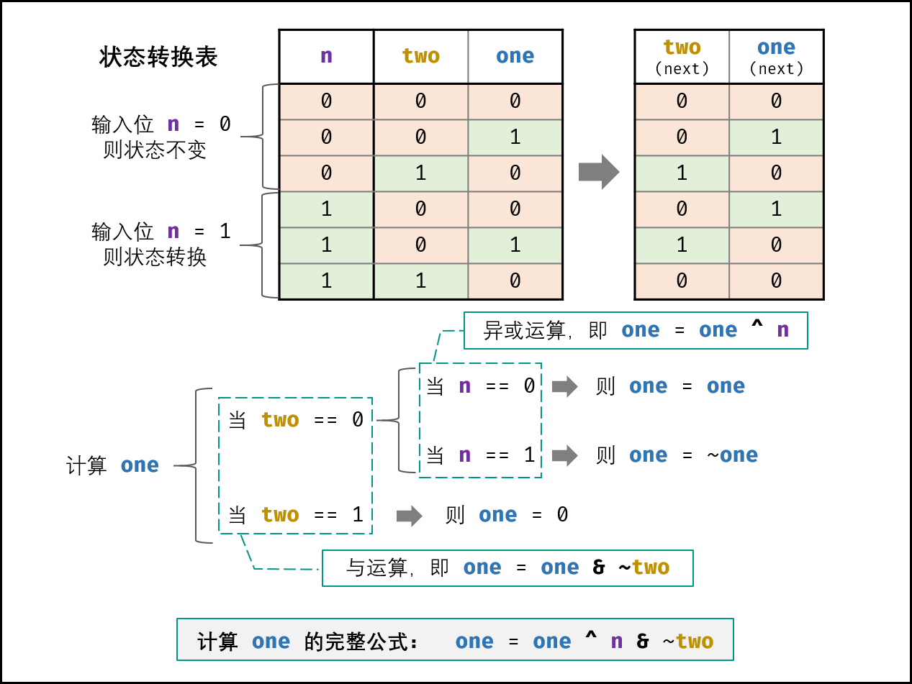
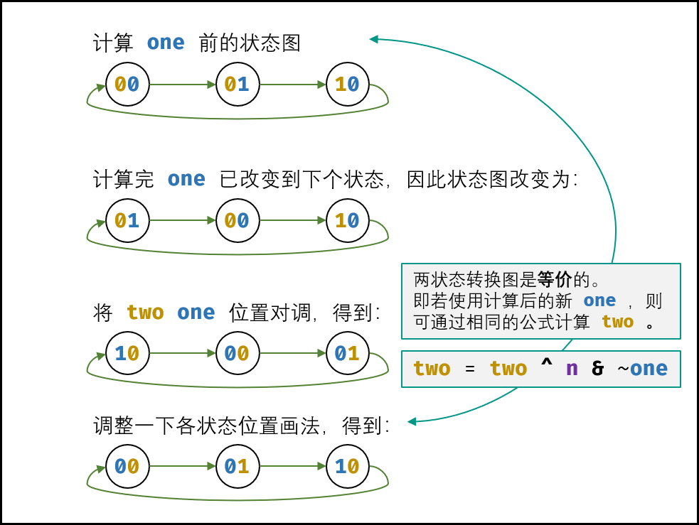

## [面试题 56 - II. 数组中数字出现的次数 II](https://leetcode.cn/problems/shu-zu-zhong-shu-zi-chu-xian-de-ci-shu-ii-lcof/)
同：[137. 只出现一次的数字 II](https://leetcode.cn/problems/single-number-ii/description/)


### 题目描述

在一个数组中除了一个数字只出现一次之外，其他数字都出现了三次。

请找出那个只出现一次的数字。

你可以假设满足条件的数字一定存在。

**思考题：**

- 如果要求只使用 `O(n)` 的时间和额外 `O(1)` 的空间，该怎么做呢？

### 解法：数学，被3整除

分别累加数组中每个元素的二进制中出现的数字，那么出现三次的数字，二进制位上最后累加的结果一定能被 3 整除。不能被 3 整除的位，就属于只出现一次的数字。

```java
class Solution {
    /**
     * 找出数组中只出现一次的数字，其它数字都出现三次
     *
     * @param nums 数字
     * @return 只出现一次的数字
     */
    public int singleNumber(int[] nums) {
        if (nums == null || nums.length == 0) {
            return 0;
        }
        int[] bits = new int[32];
        for (int num : nums) {
            for (int i = 0; i < 32; i++) {
                bits[i] = bits[i] + (num & 1);//计算num在当前位是否是1
                num = num >> 1;//右移1位
            }
        }

        int res = 0;
        for (int i = 0; i < 32; i++) {
            if (bits[i] % 3 != 0) {//如果和3取余不是0，说明就是那个唯一数的第i位
                res = res | (1 << i);//先二进制移位，按位或可以将之前的二进制位合并，也就是最后的数
            }
        }
        return res;
    }
}
```
#### 帅地写法
```java
class Solution {
    /**
     * 找出数组中只出现一次的数字，其它数字都出现三次
     *
     * @param nums 数字
     * @return 只出现一次的数字
     */
    public int singleNumber(int[] nums) {
        if (nums == null || nums.length == 0) {
            return 0;
        }
        int n = nums.length;
        int m = 1;
        int res = 0;
        for(int i = 0;i<32;i++) {
            int total = 0;
            for(int num:nums) {
                if((num & m) != 0){//不等于0加1。就是第1位多少个1加上，第2位多少个1加上
                    total++;
                }
            }
            total = total % 3;//能不能被3整除，要么0要么1
            res = res + total * m;//转十进制
            m = m << 1;//左移一位比较，就是乘2的次方
        }
        return res;
    }
}
```

### 解法：数字电路设计优化(有限状态自动机)
O(n) O(1)
````
按照和3取余数为 0,1,2 即：00 01 10
异或运算：x ^ 0 = x​ ， x ^ 1 = ~x
与运算：x & 0 = 0 ， x & 1 = x

计算 one 方法：

设当前状态为 two one ，此时输入二进制位 n 。如下图所示，通过对状态表的情况拆分，可推出 one 的计算方法为：

if two == 0:
  if n == 0:
    one = one
  if n == 1:
    one = ~one
if two == 1:
    one = 0
引入 异或运算 ，可将以上拆分简化为：

if two == 0:
    one = one ^ n
if two == 1:
    one = 0
引入 与运算 ，可继续简化为：

one = one ^ n & ~two

修改为新 one 后，得到了新的状态图。观察发现，可以使用同样的方法计算 two ，即：

two = two ^ n & ~one

以上是对数字的二进制中 “一位” 的分析，而 int 类型的其他 31 位具有相同的运算规则，因此可将以上公式直接套用在 32 位数上。

遍历完所有数字后，各二进制位都处于状态 00 和状态 01 （取决于 “只出现一次的数字” 的各二进制位是 1 还是 0 ），而此两状态是由 one 来记录的（此两状态下 twos 恒为 0 ），因此返回 ones 即可。
````



````java
class Solution {
    public int singleNumber(int[] nums) {
        int a = 0, b = 0;
        for (int num : nums) {
            a = (a ^ num) & ~b;
            b = (b ^ num) & ~a;//b一直为0
        }
        return a;
    }
}
````