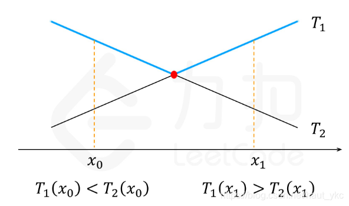

# 69.鸡蛋落地（谷歌经典面试题）

你将获得 K 个鸡蛋，并可以使用一栋从 1 到 N  共有 N 层楼的建筑。

每个蛋的功能都是一样的，如果一个蛋碎了，你就不能再把它掉下去。

你知道存在楼层 F ，满足 0 <= F <= N 任何从高于 F 的楼层落下的鸡蛋都会碎，从 F 楼层或比它低的楼层落下的鸡蛋都不会破。

每次移动，你可以取一个鸡蛋（如果你有完整的鸡蛋）并把它从任一楼层 X 扔下（满足 1 <= X <= N）。

你的目标是确切地知道 F 的值是多少。

无论 F 的初始值如何，你确定 F 的值的最小移动次数是多少？
````
示例 1：

输入：K = 1, N = 2
输出：2
解释：
鸡蛋从 1 楼掉落。如果它碎了，我们肯定知道 F = 0 。
否则，鸡蛋从 2 楼掉落。如果它碎了，我们肯定知道 F = 1 。
如果它没碎，那么我们肯定知道 F = 2 。
因此，在最坏的情况下我们需要移动 2 次以确定 F 是多少。
示例 2：

输入：K = 2, N = 6
输出：3
示例 3：

输入：K = 3, N = 14
输出：4
````

提示：
- 1 <= K <= 100
- 1 <= N <= 10000

### 解法一：动态规划
我们定义dp(K,N)表示鸡蛋数为K，楼层为N的状态，当我们从第x楼扔鸡蛋时：
- 1）如果鸡蛋不碎，那么状态变成 (K,N−X)，即我们鸡蛋的数目不变，但答案只可能在上方的 N−X 层楼了。也就是说，我们把原问题缩小成了一个规模为 (K,N−X) 的子问题；
- 2）如果鸡蛋碎了，那么状态变成 (K−1,X−1)，即我们少了一个鸡蛋，但我们知道答案只可能在第 X 楼下方的 X−1 层楼中了。也就是说，我们把原问题缩小成了一个规模为 (K−1,X−1) 的子问题。

这样一来，我们定义dp(K,N)为在状态(K,N)下最少需要的步数，通过以上分析我们可以得到转移方程：
<pre>dp(k,n) = 1+min{max{dp(k-1,x-1),dp(k,n-x)}};</pre>

从以上转移方程不难看出，我们似乎需要暴力枚举X的值从而得到新的状态，但是这样会使得复杂度达到O(K*N*N)，这是无法通过这道题的，因此我们需要想办法优化枚举的过程。

我们观察到dp(K,N)是一个关于N的单调递增函数，我们稍微的思考一下，对于鸡蛋数K固定的情况下，楼层N的增多，需要的步数一定不会减小，同理我们可以发现第二项的dp(K,N-X)是随着X单调递减的函数。我们假设T1和T2分别表示这两个函数，并假设连续，如下图所示：
<br>
我们要找的使这两个函数最大值的最小值的点一定是这两个函数的交点，但是由于T1和T2是离散函数，其中x的取值一定是一些整数点，因此倘若T1和T2的交点不是整数点，则我们要找的点一定是最靠近交点的整数点，此时似乎问题豁然开朗。我们可以通过二分找到交点处左边和右边最近的整数点，并且可以证明，若交点不是整数点，则靠近交点左端的点坐标+1就是右端离交点最近的点。

````java
class Solution {

    Map<Integer, Integer> map = new HashMap<>();

    public int superEggDrop(int K, int N) {
        return dp(K, N);
    }

    private int dp(int k, int n) {
        if (map.containsKey(n * 100 + k)) {
            return map.get(n * 100 + k);
        }
        int ans;
        if (n == 0) {
            ans = 0;
        } else if (k == 1) {
            ans = n;
        } else {
            int l = 1, r = n;
            while (l + 1 < r) {
                int mid = (l + r) / 2;
                int t1 = dp(k - 1, mid - 1);
                int t2 = dp(k, n - mid);
                if (t1 < t2) {
                    l = mid;
                } else if (t1 > t2) {
                    r = mid;
                } else {
                    l = r = mid;
                }
            }
            ans = 1 + Math.min(Math.max(dp(k - 1, l - 1), dp(k, n - l)), Math.max(dp(k - 1, r - 1), dp(k, n - r)));
        }

        map.put(n * 100 + k, ans);

        return ans;
    }
}
````


### 解法二：数学法
该方法是我们通常所说的没见过就不太可能想得出来，并且读过题解也很容易忘记的方法。

我们反过来思考该问题：如果我们可以做T次操作，而且有K个鸡蛋，那么我们能找到答案的最高的N是多少？我们假设f(T,K)为在上述条件下的N，如果我们能够求出所有的f(T,K)，那么只需要找到最小的满足f(T,K)≥N的T即可。

我们仍然使用动态规划，因为我们需要找到最高的N，因此我们不必思考到底在哪里仍这个鸡蛋，我们只需要知道扔出这个鸡蛋，到底会发生什么？

- 1）如果鸡蛋没碎，那么对应的是f(T-1,K),也就是说在这一层的上方可以有f(T-1,K)层。
- 2）如果鸡蛋碎了，那么对应的应该是f(T-1,K-1),也就是说在这一层的下方可以有f(T-1,K-1)层。

因此我们可以写出转移方程:
<pre>
f(t,k)=1+f(t-1,k-1)+f(t,k-1); //碎次数加不碎次数，至少一次
</pre>
边界条件为：当T≥1时，f(T,1)=T,当K≥1时，f(1,K)=1。

而对于操作次数T,我们可以发现其一定不会超过楼层数N，因此T≤N。
````java
class Solution {
    public int superEggDrop(int K, int N) {
        if (N == 1) return 1;
        //先循环k,因为必须先把所有鸡蛋的可能循环结束，然后再根据次数找最大的N
        int[][] f = new int[N + 1][K + 1];
        for (int i = 1; i <= K; i++) {
            f[1][i] = 1;
        }
        int ans = -1;
        for (int i = 2; i <= N; i++) {
            for (int j = 1; j <= K; j++) {
                f[i][j] = 1 + f[i - 1][j - 1] + f[i - 1][j];
                if (f[i][K] >= N) {//超过N楼了，就可以跳出了
                    ans = i;
                    break;
                }
            }
        }

        return ans;

    }
}
````