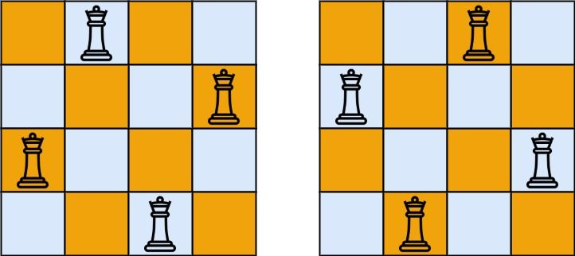

# [N 皇后](https://leetcode.cn/problems/n-queens)

## 题目描述

<!-- description:start -->

<p>按照国际象棋的规则，皇后可以攻击与之处在同一行或同一列或同一斜线上的棋子。</p>

<p><strong>n&nbsp;皇后问题</strong> 研究的是如何将 <code>n</code>&nbsp;个皇后放置在 <code>n×n</code> 的棋盘上，并且使皇后彼此之间不能相互攻击。</p>

<p>给你一个整数 <code>n</code> ，返回所有不同的&nbsp;<strong>n<em>&nbsp;</em>皇后问题</strong> 的解决方案。</p>

<div class="original__bRMd">
<div>
<p>每一种解法包含一个不同的&nbsp;<strong>n 皇后问题</strong> 的棋子放置方案，该方案中 <code>'Q'</code> 和 <code>'.'</code> 分别代表了皇后和空位。</p>

<p>&nbsp;</p>

<p><strong>示例 1：</strong></p>

<pre>
<strong>输入：</strong>n = 4
<strong>输出：</strong>[[".Q..","...Q","Q...","..Q."],["..Q.","Q...","...Q",".Q.."]]
<strong>解释：</strong>如上图所示，4 皇后问题存在两个不同的解法。
</pre>

<p><strong>示例 2：</strong></p>

<pre>
<strong>输入：</strong>n = 1
<strong>输出：</strong>[["Q"]]
</pre>

<p>&nbsp;</p>

<p><strong>提示：</strong></p>

<ul>
	<li><code>1 &lt;= n &lt;= 9</code></li>
</ul>
</div>
</div>

<!-- description:end -->

## 解法

<!-- solution:start -->

### （记住）方法一：深度优先搜索(DFS) + 回溯

我们定义三个数组 $col$, $dg$ 和 $udg$，分别表示列、正对角线和反对角线上的是否有皇后，如果位置 $(i, j)$ 有皇后，那么 $col[j]$, $dg[i + j]$ 和 $udg[n - i + j]$ 都为 $1$。另外，我们用一个数组 $g$ 记录当前棋盘的状态，初始时 $g$ 中的所有元素都是 `'.'`。

接下来，我们定义一个函数 $dfs(i)$，表示从第 $i$ 行开始放置皇后。

在 $dfs(i)$ 中，如果 $i=n$，说明我们已经完成了所有皇后的放置，我们将当前 $g$ 放入答案数组中，递归结束。

否则，我们枚举当前行的每一列 $j$，如果位置 $(i, j)$ 没有皇后，即 $col[j]$, $dg[i + j]$ 和 $udg[n - i + j]$ 都为 $0$，那么我们可以放置皇后，即把 $g[i][j]$ 改为 `'Q'`，并将 $col[j]$, $dg[i + j]$ 和 $udg[n - i + j]$ 都置为 $1$，然后继续搜索下一行，即调用 $dfs(i + 1)$，递归结束后，我们需要将 $g[i][j]$ 改回 `'.'` 并将 $col[j]$, $dg[i + j]$ 和 $udg[n - i + j]$ 都置为 $0$。

在主函数中，我们调用 $dfs(0)$ 开始递归，最后返回答案数组即可。

*时间复杂度 $(n^2 \times n!)$，空间复杂度 $O(n)$。其中 $n$ 是题目给定的整数*

<!-- tabs:start -->

```java
class Solution {
    private List<List<String>> ans = new ArrayList<>();
    private int[] col;
    private int[] dg;
    private int[] udg;
    private String[][] g;
    private int n;

    public List<List<String>> solveNQueens(int n) {
        this.n = n;
        col = new int[n];
        dg = new int[n << 1];
        udg = new int[n << 1];
        g = new String[n][n];
        for (int i = 0; i < n; ++i) {
            Arrays.fill(g[i], ".");
        }
        dfs(0);
        return ans;
    }

    private void dfs(int i) {
        if (i == n) {
            List<String> t = new ArrayList<>();
            for (int j = 0; j < n; ++j) {
                t.add(String.join("", g[j]));
            }
            ans.add(t);
            return;
        }
        for (int j = 0; j < n; ++j) {
            if (col[j] + dg[i + j] + udg[n - i + j] == 0) {
                g[i][j] = "Q";
                col[j] = dg[i + j] = udg[n - i + j] = 1;
                dfs(i + 1);
                col[j] = dg[i + j] = udg[n - i + j] = 0;
                g[i][j] = ".";
            }
        }
    }
}
```

```java
class Queen8 {
    List<List<String>> ans = new ArrayList<>();
    int max;
    int[] array;

    public List<List<String>> solveNQueens(int n) {
        max = n;
        array = new int[max];
        check(0);
        return ans;
    }

    void check(int n) {
        //终止条件是最后一行已经摆完，由于每摆一步都会校验是否有冲突，所以只要最后一行摆完，说明已经得到了一个正确解
        if (n == max) {
            print();
            return;
        }
        //从第一列开始放值，然后判断是否和本行本列本斜线有冲突，如果OK，就进入下一行的逻辑
        for (int i = 0; i < max; i++) {
            array[n] = i;
            if (judge(n)) {
                check(n + 1);
            }
        }
    }

    boolean judge(int n) {
        for (int i = 0; i < n; i++) {
            if (array[i] == array[n] || Math.abs(n - i) == Math.abs(array[n] - array[i])) {
                return false;
            }
        }
        return true;
    }

    void print() {
        List<String> temp = new ArrayList<>();
        for (int k : array) {
            StringBuilder sb = new StringBuilder();
            for (int j = 0; j < max; j++) {
                if (k == j) {
                    sb.append("Q");
                } else {
                    sb.append(".");
                }
            }
            temp.add(sb.toString());
        }
        ans.add(temp);
    }

}
```

# [N 皇后 II](https://leetcode.cn/problems/n-queens-ii/)

## 题目描述

<!-- description:start -->

<p><strong>n&nbsp;皇后问题</strong> 研究的是如何将 <code>n</code>&nbsp;个皇后放置在 <code>n × n</code> 的棋盘上，并且使皇后彼此之间不能相互攻击。</p>

<p>给你一个整数 <code>n</code> ，返回 <strong>n 皇后问题</strong> 不同的解决方案的数量。</p>

<p>&nbsp;</p>

<div class="original__bRMd">
<div>
<p><strong>示例 1：</strong></p>

<pre>
<strong>输入：</strong>n = 4
<strong>输出：</strong>2
<strong>解释：</strong>如上图所示，4 皇后问题存在两个不同的解法。
</pre>

<p><strong>示例 2：</strong></p>

<pre>
<strong>输入：</strong>n = 1
<strong>输出：</strong>1
</pre>

<p>&nbsp;</p>

<p><strong>提示：</strong></p>

<ul>
	<li><code>1 &lt;= n &lt;= 9</code></li>
</ul>
</div>
</div>

<!-- description:end -->

## 解法

<!-- solution:start -->

### 方法一：回溯

我们设计一个函数 $dfs(i)$，表示从第 $i$ 行开始搜索，搜索到的结果累加到答案中。

在第 $i$ 行，我们枚举第 $i$ 行的每一列，如果当前列不与前面已经放置的皇后发生冲突，那么我们就可以放置一个皇后，然后继续搜索下一行，即调用 $dfs(i + 1)$。

如果发生冲突，那么我们就跳过当前列，继续枚举下一列。

判断是否发生冲突，我们需要用三个数组分别记录每一列、每一条正对角线、每一条反对角线是否已经放置了皇后。

具体地，我们用 $cols$ 数组记录每一列是否已经放置了皇后，用 $dg$ 数组记录每一条正对角线是否已经放置了皇后，用 $udg$ 数组记录每一条反对角线是否已经放置了皇后。

*时间复杂度 $O(n!)$，空间复杂度 $O(n)$。其中 $n$ 是皇后的数量*

<!-- tabs:start -->

```java
class Solution {
    private int n;
    private int ans;
    private boolean[] cols = new boolean[10];
    private boolean[] dg = new boolean[20];
    private boolean[] udg = new boolean[20];

    public int totalNQueens(int n) {
        this.n = n;
        dfs(0);
        return ans;
    }

    private void dfs(int i) {
        if (i == n) {
            ++ans;
            return;
        }
        for (int j = 0; j < n; ++j) {
            int a = i + j, b = i - j + n;
            if (cols[j] || dg[a] || udg[b]) {
                continue;
            }
            cols[j] = true;
            dg[a] = true;
            udg[b] = true;
            dfs(i + 1);
            cols[j] = false;
            dg[a] = false;
            udg[b] = false;
        }
    }
}
```

````java
class BaHuangHouWenTi {
    //定义一个max表示共有多少个皇后
    int max;
    //定义数组arry，保存存放的结果
    int[] arr;
    int count = 0;

    public int totalNQueens(int n) {
        max = n;
        arr = new int[max];
        check(0);
        return count;
    }

    //。编写一个方法，放置第n个皇后
    private void check(int n) {//n表示所在行数，n=0时从 第一行开始
        if (n == max) {//n=8,8个皇后已经放好了
            count++;
            return;
        }//n == max
        //依次放入皇后并判断是否冲突
        for (int i = 0; i < max; i++) {
            //先把当前皇后n，放到该行的第一列（本文创建了一维数组，索引表示行数，值代表列）
            arr[n] = i;//将当前行的皇后放在不同列
            //判断是否冲突
            if (judge(n)) {//不冲突
                //接着放
                check(n + 1);//递归，逐行判断（索引代表行，即n）
            }
        }//for
    }//check

    //。查看当放置第n个皇后，检测是否和前一个已经摆放的皇后冲突
    private boolean judge(int n) {//n表示第n个皇后
        for (int i = 0; i < n; i++) {//从第一行比较到当前行
            //表示第n个皇后和前面n减1个在同一列或者对角线从、
            if (arr[i] == arr[n] || Math.abs(n - i) == Math.abs(arr[n] - arr[i])) {
                return false;
            }//if
        }//for
        return true;
    }


}
````