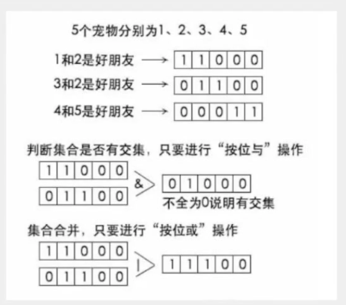

# 朋友圈个数
## 题目描述
假如给你n个宠物和m对朋友关系，你能计算出这些宠物之间形成多少朋友圈。
例如：
````
1，2，3，4，5号宠物。
现在1和2是好朋友，2和3是好朋友，4和5是好朋友。
这样1-2-3 4-5 就是两个。
````

ps:可能宠物很多，并且关系很复杂。


### 解法一：bitmap
<strong>
使用BitMap来存储这些关系集合，然后进行融合。如图：

</strong>

### 解法二:并查集
````
关系： ① -> ② <- ③   ④ -> ⑤ 
这是一个指向父节点的树。
如果增加1和3朋友关系，可以找1和3的根是否相同，相同不需要相连。不然就会成了环。
如果添加3和4朋友关系，可以找3和4的根是否相同，不同则将他们的根2和5相连。
可以用数组来表示这个树的关系，初始时刻数组中都是-1，将一个数的根设为另一个数的根的下标就行。
比如上面的关系就是：
-1 -1 -1 -1 -1 
1  -1  1  4 -1   1改为2的下标，2不动，3改为2的下标，4改为5的下标，5不动。
然后我们只需要查找到-1的个数即可。

假设朋友关系是：1和2是朋友，2和3是朋友，3和4是朋友，4和5是朋友。就会变成：① -> ② -> ③ -> ④ -> ⑤ 
会退化成一个链表，所以在合并的时候，需要将矮树合并到高树上去，也就是按秩(高度)合并。
另外在查找的时候，可以按路径压缩优化，和按秩(高度)合并选一个就可，因为路径压缩优化会改变树的高度再按秩(高度)合并就不准了。
````

````java
public class UnionFind {
    // 存储并查集
    private int[] elements;
    // 存储树的高度
    private int[] heights;

    UnionFind(int n) {
        elements = new int[n];
        heights = new int[n];
        for (int i = 0; i < n; i++) {
            // 初始都为-1
            elements[i] = -1;
            // 初始高度1
            heights[i] = 1;
        }
    }

    // 找到一个数的根
    public int find(int x) {
        while(elements[x] != -1) {
            x = elements[x];
        }
        return x;
    }

    // 把两个数的根连起来
    public void union(int x, int y) {
        // x的根
        int rootx = find(x);
        // y的根
        int rooty = find(y);
        // 如果不是同一个根就连起来
        if(rootx != rooty) {
            // 矮树向高树合并，按秩(高度)合并优化
            if(heights[rootx] > heights[rooty]) {
                elements[rooty] = rootx;
            } else if(heights[rootx] < heights[rooty]) {
                elements[rootx] = rooty;
            } else {
                // 如果高度相同，随便合并
                elements[rootx] = rooty;
                // 但是记得合并后高度加一
                heights[rooty]++;
            }

        }
    }

    // 计算形成了多少颗树
    public int count() {
        int count = 0;
        for(int i=0; i<elements.length; i++) {
            if(elements[i] == -1) {//-1就是每个树的根节点
                count++;
            }
        }
        return count;
    }

    // 打印并查集
    public void print() {
        for(int i=0; i<elements.length; i++) {
            System.out.print(elements[i] + " ");
        }
        System.out.println();
        for(int i=0; i<heights.length; i++) {
            System.out.print(heights[i] + " ");
        }
        System.out.println();
    }
}
````


