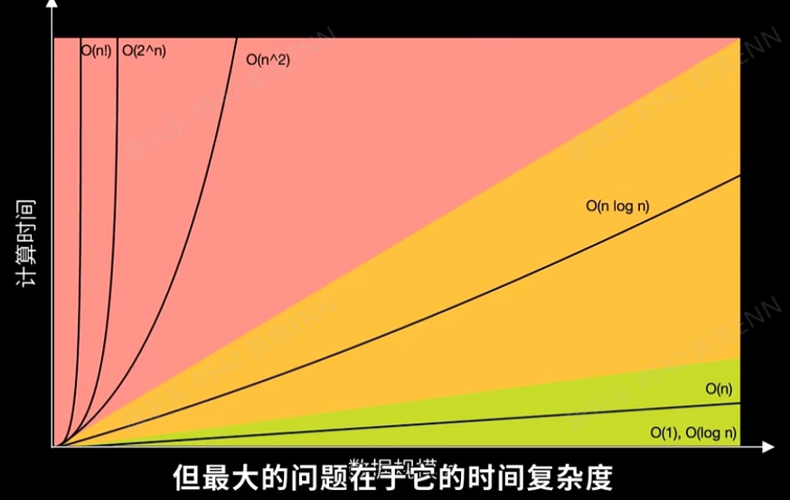
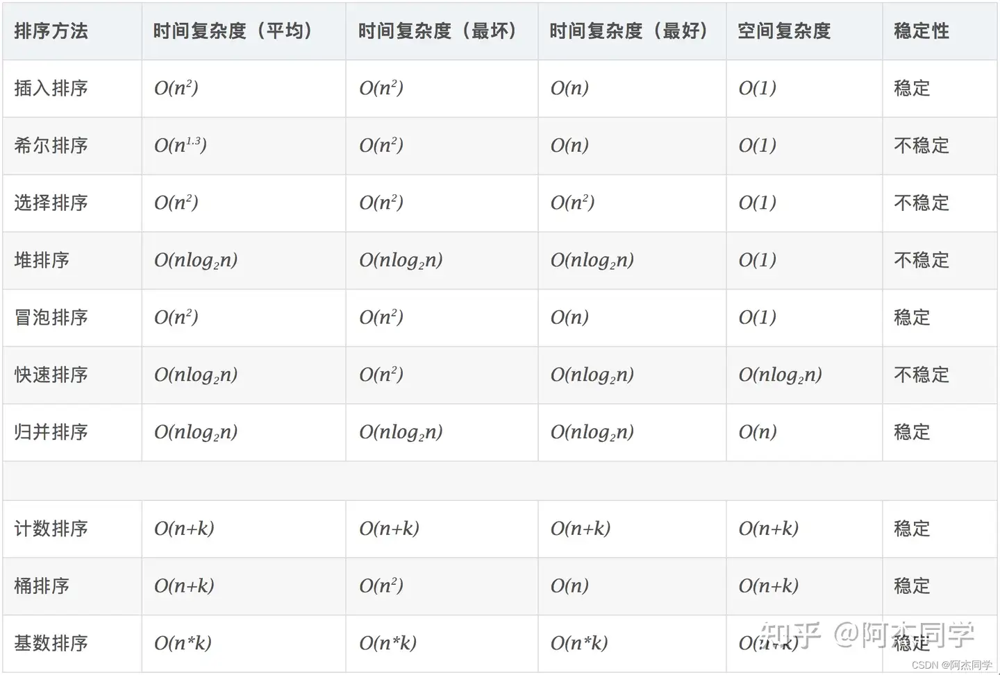
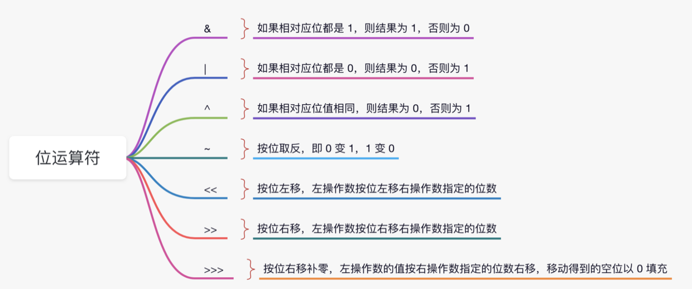
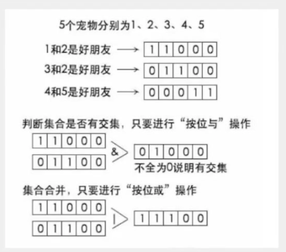
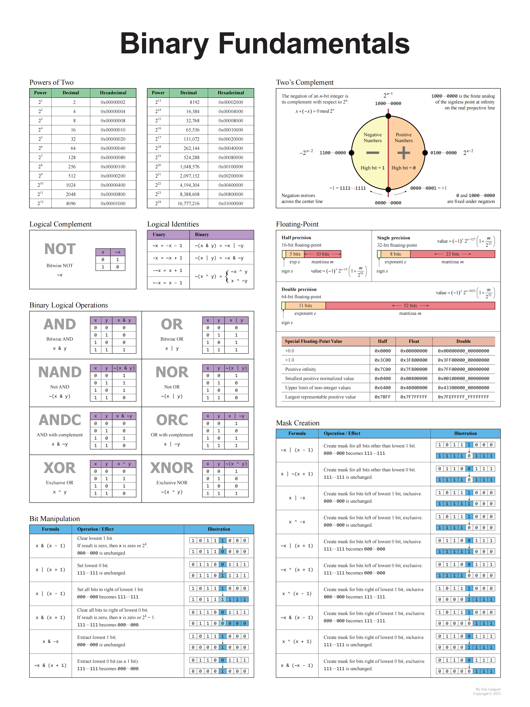
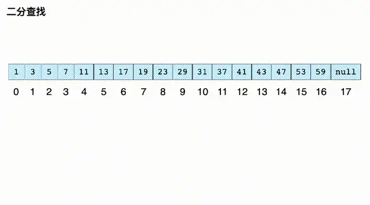

# 基础





````
为啥区分稳定排序和不稳定排序？
因为稳定排序可以保证相同的数据可以按照上次的顺序继续排列，不稳定排序就不会保证。
虽然最终排序一样但是在很多场景中不行，比如大家考试成绩有人一样，那我们按照什么排会比较公正呢，总不能一会这个人前面一会那个人前面，那比如我们按照之前的学号放是不是合理，这个时候就适合稳定的排序。
比如：        a[0]=1,a[1]=2,a[2]=5,a[3]=2
稳定排序：    a[0]=1,a[1]=2,a[3]=2,a[2]=5
不稳定排序：  a[0]=1,a[3]=2,a[1]=2,a[2]=5
             a[0]=1,a[1]=2,a[3]=2,a[2]=5
````

## 一、常用数据结构
````java
import java.util.*;

//栈
Stack<Integer> stack = new Stack<>();
stack.push(val);//放入元素
stack.pop();//取出并移除栈顶元素
stack.peek();//获取栈顶元素
stack.isEmpty();
stack.size();

//数组双端队列
//作为栈使用时，可以使用push()（相当于addFirst()）在顶部添加元素，使用pop()（相当于removeFirst()）从顶部移除元素。
//作为队列使用时，可以使用offer()（相当于addLast()）在尾部添加元素，使用poll()（相当于removeFirst()）从头部移除元素。
Deque<TreeNode> q = new ArrayDeque<>();
q.push(i);//在顶部添加元素 addFirst()
q.addFirst(i);//在顶部添加元素
q.add(i);//末尾放入i addLast()
q.offerFirst(i);//在顶部添加元素
q.offer(i);//末尾放入i offerLast()
q.peek();//取出头部元素
q.peekLast();//取出q尾部的元素
q.pop();//取出头部元素并移除
q.poll();//取出头部元素并移除
q.pollLast();//取出q尾部的元素并移除
q.removeFirst();//删除头元素
q.removeLast();//删除末尾元素
q.isEmpty();
q.size();

//双向链表
Deque<TreeNode> queue = new LinkedList<>();
queue.push(i);//在顶部添加元素 addFirst()
queue.add(i);//也是往后放，就是尾添加
queue.offer(i);//末尾放入i
queue.peek();//取出头部元素
queue.pop();//取出头部元素并移除
queue.poll();//取出头部元素并移除
queue.removeFirst();//删除头元素
queue.removeLast();//删除末尾元素
queue.isEmpty();

//小根堆
Queue<Integer> min = new PriorityQueue<>();
//大根堆
Queue<Integer> max = new PriorityQueue<>(Comparator.reverseOrder());
Queue<Integer> max = new PriorityQueue<>((x,y)->y-x);
max.add();//在尾部添加元素
max.offer();//末尾放入i
max.poll();//取出头部元素并移除
max.remove(i);//删除某个元素
max.peek();//取出头部元素
max.size();

//数组的集合对象
List<Integer> list = new ArrayList<>();
list.add(i);
list.get(index);
list.size();
list.contains(i);//数组是否包含，只能是简单类型
list.set(index,i);//指定下标插入元素，如果存在就替换
list.remove(index);
list.stream().mapToInt(Integer::intValue).toArray();//转int[],mapToInt才有toArray方法

//set
Set<String> set = new HashSet<>();
set.add(i);
set.contains(i);//是否存在


//hash表
Map<String,String> map = new HashMap<>();
map.put(k,v);
map.containsKey(k);//key是否存在
//int数组
int[] res = new int[n];//0 - n-1
res.length;//长度
````
````
ASCII码表:

48 0
57 9

65 A
90 Z

97 a
122 z
````

## 二、方法
````java
import java.util.*;

String str = String.valueOf(c);
str.substring(i,j);//从i到j截取字符[i,j)
str.indexOf(word);//字符在的首个下标
str.lastIndexOf(word);//字符所在的最后下标
str.startsWith(word);//字符是否word开头
str.endsWith(word);//字符是否word结尾
str.length();//字符长度
str.split(",");//按照","分割字符

String str = String.join(",", list);//按照","将list合并成字符串

char[] cs = str.toCharArray();//字符串转char数组
char c = str.charAt(i);//字符串第i位字符
Character ch = c;//包装类
Character.isLetter();//判断是否为字母，大写和小写
Character.isDigit();//判断是否为数字

StringBuilder temp = new StringBuilder(sb).append(" ").append(word);//StringBuilder连接字符
temp.toString();
temp.deleteCharAt(i);//删除指定下标的字符
temp.startsWith(word);//字符是否word开头
temp.insert(0,word);//字符放入指定位置

Math.pow(2, target);//2的target次方
Math.max(max, i);//max和i比较谁大
Math.min(min, i);//min和i比较谁小
Math.abs(n);//n的绝对值
(int) Math.sqrt(x);//对x开根

Arrays.fill(array, 1);//赋初始值
int[] bak = Arrays.copyOf(array, array.length);//复制数组
Arrays.setAll(bak, i -> array[i]);//bak[i] = array[i]
//排序，如果y是奇数且x是偶数，结果为 1，意味着y应该排在x前面。
//如果y和x都是奇数或者都是偶数，结果为 0，保持它们的相对顺序不变。
//如果y是偶数且x是奇数，结果为 -1，意味着x应该排在y前面。
Arrays.sort(bak, (x, y) -> (y & 1) - (x & 1));
Arrays.stream(array);//流化

List<int[]> list = new ArrayList<>();
list.toArray(new int[list.size()]);//list 转 int[][]
List<Integer> list = new ArrayList<>();
list.stream().mapToInt(Integer::intValue).toArray();//list 转 int[]

Integer.MIN_VALUE = -2147483648;//最小值
Integer.MAX_VALUE = 2147483647;//最大值

long n = -exponent;//exponent可能是负数再负可能会超过int最大值，比如int exponent = -2147483648; -exponent=2147483648超过int最大值2147483647。 

int[] ch = new int[128];//字符一般使用128个

a.compareTo(b) >= 0;//a >= b

Integer.parseInt(sb.toString());//将字符串数字转成int类型

````

## 三、基本运算
````java
a << 1; //左移是乘2的次方 <<
a >> 1; //右移是除2的次方 >>

a ^ a == 0; //a 异或 a 会抵消等于0
a ^ a ^ b == b; //a 异或 a 异或 b 就等于b
a ^ b == c; a == b ^ c; b == a ^ c; //异或的逆运算也是异或

a = a & (a-1); //a与a-1相与可以消除最右边的1
a & (a-1) == 0; //说明a是2的幂

a & 1 == 1; //a 是奇数
a & 1 == 0; //a 是偶数

x ^ 0 == x; // x是任意数字
x ^ 1 == ~x; // 就是对x进行按位取反(~x)
x & 0 == 0; // x是任意数字
x & 1 == x; // x只能是0 或 1

int index = x & -x; //x的二进制表示中最低位那个 1
x & -x == x; //说明x是2的幂

(a + b) % n == ((a % n) + (b % n)) % n;//a+b和n的余数就是 a和n的余数+b和n的余数再和n取余
a % n == (a % n) % n;//取余一次和两次是一样的
(a % n + b) % n == (a + b) % n;//a%n=r => (r+b)%n  因为 a=k*n+r k*n%n=0 所以也是 (a+b)%n

a % (2^n) == a & (2^n - 1);//a对2的n次方取余，其实就是取a的后n位的二进制位

~b + 1 == -b; //按照二进制补码的定义，这两个是一样的(二进制补码是一种表示有符号整数的方法，它通过将一个数的二进制表示取反（即按位取反）然后加1来得到该数的负数。)

判断集合是否有交集：A∩B，可以按位与操作，位运算：a & b
{2,3} ∩ {1,2} = {2}
1 1 0 0 {2,3}
              & 0 1 0 0 {2} 不全是0，就是有交集
0 1 1 0 {1,2}

将集合合并，可以按位或。就是并集：A∪B 位运算：a ∣ b
{3,4} ∪ {2,3} = {2,3,4}
1 1 0 0 0 {3,4}
                | 1 1 1 0 0 {2,3,4}
0 1 1 0 0 {2,3}

差集：A∖B  位运算：a & ∼b
{3,4} ∖ {0,1,4} = {4}
1 1 0 0 0 
         & 1 0 0 0 0 
1 0 0 1 1 

集合是否包含于集合：A⊆B 位运算：a & b == a; 或 a ∣ b == b; 或 (a & ~b) == 0;
{3,4} ⊆ {0,2,3,4} = {3,4}
1 1 0 0 0 
         & 1 1 0 0 0 
1 1 1 0 1 

元素是否属于集合：i∈S  位运算：(s >> i) & 1 == 1;
2 ∈ {0,2,3} 
(1101 >> 2) & 1 = 1

集合添加元素：S∪{i} 位运算：s ∣ (1 << i)
{0,3}∪{2} 
1001 ∣ (1 << 2)

集合删除元素：S∖{i} 位运算：s & ∼(1 << i)
{0,2,3}∖{2} 
1101 & ∼(1 << 2)

删除集合最小的元素：s & (s − 1)
s = 101100;
s-1 = 101011; // 最低位的 1 变成 0，同时 1 右边的 0 都取反，变成 1
s & (s-1) = 101000; //消除s二进制中最右侧的1

如果要从大到小枚s 的所有子集sub（从s 枚举到空集∅），可以这样写：
int sub = s;
do {
// 处理 sub 的逻辑
sub = (sub - 1) & s;
} while (sub != s);

如果要从大到小枚举 s 的所有子集sub（非空子集），可以这样写：
for (int sub = s; sub > 0; sub = (sub - 1) & s) {
// 处理 sub 的逻辑
}

````






<strong>灵神位运算分享：</strong>[从集合论到位运算，常见位运算技巧分类总结](https://leetcode.cn/circle/discuss/CaOJ45/)



# 标准写法
## 一、快排


### java标准写法
````java
/**
 * 快排,时间平均O(nlogn)，空间O(1)
 * 
 * ①找基准点：一般是数组的第一个元素来充当；
 *
 * ②right：从数组的最后一个元素开始，从右往左，直到找到小于基准点的元素；每次都要right比left先走；
 *
 * ③left：从数组的第一个元素开始，从左往右，直到找到大于基准点的元素；
 *
 * ④交换 left 和 right 所在位置的两个元素；
 *
 * ⑥right 继续往左走，找到小于基准点的元素；left 继续往右走，找到大于基准点的元素；然后 left 和 right 再做交换；循环往复，直到两人相遇；
 *
 * ⑦将相遇点所在位置的元素和基准点所在位置的元素做交换，基准点到了中间位置（此时基准点左边的元素全都小于基准点右边的元素）；
 *
 * ⑧【递归】将基准点左边的所有元素当成一个数组
 *
 * @author kanglele
 * @version $Id: FastRow, v 0.1 2022/6/9 10:49 kanglele Exp $
 */
public class FastRowSort {

    public void sort(int[] arr){
        qsort(arr, 0, arr.length - 1);
    }
    
    /**
     * 将数组拆分，递归进行二分查找
     */
    private void qsort(int[] arr, int begin, int end) {
        if (begin >= end) {
            return;
        }
        int partition = partition(arr, begin, end);
        qsort(arr, begin, partition - 1);
        qsort(arr, partition + 1, end);
    }

    private int partition(int[] arr, int begin, int end) {
        // 以左边为基准点那最后i就和左边换，以右边为基准点就和右边换，比大小移动是一样。
        int base = arr[end];// 以右侧为基准点。
        int i = begin;
        int j = end;
        while (i < j) {
            while (i < j && arr[i] <= base) {//从左侧找到第一个大于基准点的数
                i++;
            }
            while (i < j && arr[j] >= base) {//从右侧找到第一个小于基准点的数
                j--;
            }
            swap(arr,i, j);// 交换
        }
        swap(arr,i, end);// partition和基准位交换
        return i;
    }

    private void swap(int[] arr, int i, int j) {
        int temp = arr[i];
        arr[i] = arr[j];
        arr[j] = temp;
    }
}

````

### 1. 把数组排成最小的数
*时间复杂度：$O(n log n)$*
````java
class Solution {
    public String minNumber(int[] nums) {
        qSort(nums, 0, nums.length - 1);
        String res = "";
        for (int num : nums) {
            if (!res.equals("0")) {
                res += num;
            }
        }
        return res;
    }

    private void qSort(int[] nums, int low, int high) {
        if (low > high) {
            return;
        }
        int partition = partition(nums, low, high);
        qSort(nums, low, partition - 1);
        qSort(nums, partition + 1, high);
    }

    private int partition(int[] nums, int low, int high) {
        int base = nums[high];
        int i = low;
        int j = high;
        while (i < j) {
            while (i < j && (nums[i] + "" + base).compareTo(base + "" + nums[i]) <= 0) {
                i++;
            }
            while (i < j && (nums[j] + "" + base).compareTo(base + "" + nums[j]) >= 0) {
                j--;
            }
            swap(nums, i, j);
        }
        swap(nums, i, high);
        return i;
    }

    private void swap(int[] nums, int i, int j) {
        int temp = nums[i];
        nums[i] = nums[j];
        nums[j] = temp;
    }
}
````

## 二、冒泡排序


### java标准写法
````java
/**
 * 冒泡排序的时间复杂度为O(n^2)，其中n是数组的长度
 * 
 * @author kanglele
 * @version $Id: BubbleSort, v 0.1 2024/10/16 下午3:24 kanglele Exp $
 */
public class BubbleSort {
    // 冒泡排序
    public static void bubbleSort(int[] arr) {
        int n = arr.length;
        boolean swapped;
        for (int i = 0; i < n - 1; i++) {
            swapped = false;
            // 每次内循环将最大的元素“冒泡”到数组的末尾
            for (int j = 0; j < n - i - 1; j++) {
                // 相邻元素两两比较，根据升序或降序需求进行元素的位置交换
                if (arr[j] > arr[j + 1]) {
                    // 交换arr[j]和arr[j+1]
                    int temp = arr[j];
                    arr[j] = arr[j + 1];
                    arr[j + 1] = temp;
                    swapped = true;
                }
            }
            // 如果在这一趟中没有发生交换，说明数组已经有序，直接跳出循环
            if (!swapped) {
                break;
            }
        }
    }
}
````

## 三、归并排序


### java标准写法
````java
/**
 * 归并排序,时间复杂度O(nlogn)，空间复杂度O(n) out-place 稳定性排序
 *
 * @author kanglele
 * @version $Id: Merge, v 0.1 2022/6/9 10:50 kanglele Exp $
 */
public class MergeSort {

    /**
     * mergeSort 递归 对两个有序节点序列进行合并来实现排序，分治思想
     * @param arr
     * @return
     */
    public void mergeSort(int[] arr) {
        if (arr == null) {
            return;
        }
        mergeSort(arr, 0, arr.length - 1);
    }

    private void mergeSort(int[] arr, int left, int right) {
        if (left >= right) {
            return;
        }

        int mid = left + (right - left) / 2;
        // 对左半部分数组进行归并排序
        mergeSort(arr, left, mid);
        // 对右半部分数组进行归并排序
        mergeSort(arr, mid + 1, right);
        // 合并已经排好序的左半部分和右半部分数组
        merge(arr, left, mid, right);
    }

    private void merge(int[] arr, int left, int mid, int right) {
        // 创建临时数组
        int[] temp = new int[right - left + 1];
        int i = left;
        int j = mid + 1;
        int k = 0;

        // 比较左右子数组的元素，将较小的元素依次放入原数组中
        while (i <= mid && j <= right) {
            if (arr[i] <= arr[j]) {
                temp[k++] = arr[i++];
            } else {
                temp[k++] = arr[j++];
            }
        }
        // 如果左子数组还有剩余元素，将其全部放入原数组中
        while (i <= mid) {
            temp[k++] = arr[i++];
        }
        // 如果右子数组还有剩余元素，将其全部放入原数组中
        while (j <= right) {
            temp[k++] = arr[j++];
        }

        // 将临时数组 t 中的元素复制回原始数组 nums 的相应位置
        k = 0;
        for(int m = left; m <= right; m++) {
            arr[m] = temp[k++];
        }
    }
}
````

### 1. 数组中的逆序对
*时间复杂度：$O(n log n)$*
````java
class Solution {

    public int reversePairs(int[] nums) {
        if (nums == null || nums.length <= 1) {
            return 0;
        }
        return mergeSort(nums, 0, nums.length - 1);
    }

    public int mergeSort(int[] nums, int left, int right) {
        if (left >= right) {
            return 0;
        }
        int mid = (right - left) / 2 + left;
        int x1 = mergeSort(nums, left, mid);
        int x2 = mergeSort(nums, mid + 1, right);
        int x3 = merge(nums, left, mid, mid + 1, right);
        return x1 + x2 + x3;//左边的+右边的+整体(左边对右边)
    }

    public int merge(int[] nums, int l1, int r1, int l2, int r2) {
        int[] temp = new int[r2 - l1 + 1];
        int count = 0;
        int i = l1;
        int j = l2;
        int k = 0;
        while (i <= r1 && j <= r2) {
            if (nums[i] > nums[j]) {
                count = count + (l2 - i);//如果j小于i,说明i到r1之间位置都是比j大。
                temp[k++] = nums[j++];
            } else {
                temp[k++] = nums[i++];
            }
        }
        // 如果左子数组还有剩余元素，将其放入临时数组 t
        while (i <= r1) {
            temp[k++] = nums[i++];
        }
        // 如果右子数组还有剩余元素，将其放入临时数组 t
        while (j <= r2) {
            temp[k++] = nums[j++];
        }
        // 将临时数组 t 中的元素复制回原始数组 nums 的相应位置
        k = 0;
        for (int m = l1; m <= r2; m++) {
            nums[m] = temp[k++];
        }
        return count;
    }
}

````

### 2. 计算右侧小于当前元素的个数
*时间复杂度：$O(n log n)$*
````java
import java.util.*;

class Solution {

    private List<Integer> res;
    private int[] index;
    private int[] ans;

    public List<Integer> countSmaller(int[] nums) {
        if (nums == null || nums.length == 0) {
            return null;
        }
        res = new ArrayList<>();
        ans = new int[nums.length];
        index = new int[nums.length];//存储下标，防止交换的时候失去数据位置
        for (int i = 0; i < nums.length; i++) {
            index[i] = i;
        }
        mergeSort(nums, 0, nums.length - 1);

        for (int an : ans) {
            res.add(an);
        }
        return res;
    }

    private void mergeSort(int[] nums, int left, int right) {
        if (left >= right) {
            return;
        }
        int mid = left + (right - left) / 2;
        mergeSort(nums, left, mid);
        mergeSort(nums, mid + 1, right);
        merge(nums, left, mid, right);
    }

    private void merge(int[] nums, int left, int mid, int right) {
        int[] temp = new int[right - left + 1];
        int[] tempIndex = new int[right - left + 1];//同temp，跟着交换
        int i = left;
        int j = mid + 1;
        int k = 0;
        while (i <= mid && j <= right) {
            if (nums[i] <= nums[j]) {
                temp[k] = nums[i];
                tempIndex[k] = index[i];
               //虽然i比j小，但是i比j之前都要大，因为如果j往右挪动了而i没有，说明j之前的都要小于当前i(也就是min+1到j-1的位置)，所以就是j-mid-1
                ans[index[i]] += (j - mid - 1);
                k++;
                i++;
            } else {
                temp[k] = nums[j];
                tempIndex[k] = index[j];
                k++;
                j++;
            }
        }

       //剩余的数字 先放了右所以剩下左，说明右比左小
        while (i <= mid) {
            temp[k] = nums[i];
            tempIndex[k] = index[i];
            ans[index[i]] += (j - mid - 1);
            k++;
            i++;
        }
        while (j <= right) {
            temp[k] = nums[j];
            tempIndex[k] = index[j];
            k++;
            j++;
        }

        k = 0;
        for (int m = left; m <= right; m++) {
            index[m] = tempIndex[k];//赋给原来数组
            nums[m] = temp[k];//赋给原来数组
            k++;
        }
    }
}
````

## 四、二分查找（折半查找）


### java标准写法
````java
/**
 * 二分查找 时间复杂度：O(logn)
 * 
 * @author kanglele
 * @version $Id: BinarySearch, v 0.1 2024/10/16 上午10:50 kanglele Exp $
 */
public class BinarySearch {
    public static int binarySearch(int[] nums, int target) {
        int left = 0;
        int right = nums.length - 1;

        while (left <= right) {
            // 防止溢出
            int mid = left + (right - left) / 2;

            // 检查中间元素是否是目标值
            if (nums[mid] == target) {
                return mid; // 找到目标值，返回索引
            }

            // 如果目标值小于中间元素，则在左半部分继续查找
            if (target < nums[mid]) {
                right = mid - 1;
            } else {
                // 如果目标值大于中间元素，则在右半部分继续查找
                left = mid + 1;
            }
        }

        // 如果没有找到目标值，返回 -1
        return -1;
    }
    
}
````

### 1. 旋转排序数组中的最小值
*时间复杂度：$O(log n)$*
````java
class Solution {
    public int findMin(int[] nums) {
        int l = 0, r = nums.length - 1;
        while (l < r) {
            if (nums[l] < nums[r]) {//l r内单调递增，就可以跳出。
                break;
            }
            int m = (l + r) >>> 1;
            if (nums[m] > nums[l]) {
                l = m;
            } else if (nums[m] < nums[l]) {
                r = m;//不能m-1，因为m本身可能是旋转点
            } else {
                ++l;//往右移动，也可以认为剪枝。不能直接l=m+1跨过去，因为 2 1 2 2 2
            }
        }
        return nums[l];
    }
}
````

## 五、二叉树遍历

### java标准写法
````java
/**
 * 前序遍历、中序遍历、后序遍历和层序遍历  广度优先搜索（BFS） 深度优先搜索（DFS）
 * @author kanglele
 * @version $Id: BinaryTreeTraversal, v 0.1 2024/10/16 下午4:15 kanglele Exp $
 */
public class BinaryTreeTraversal {

    /**
     * 前序遍历：根左右
     * @param root
     */
    public void preOrderTraversal(TreeNode root) {
        if (root == null) {return;}
        System.out.print(root.val + " ");
        preOrderTraversal(root.left);
        preOrderTraversal(root.right);
    }

    /**
     * 中序遍历：左根右
     * @param root
     */
    public void inOrderTraversal(TreeNode root) {
        if (root == null) {return;}
        inOrderTraversal(root.left);
        System.out.print(root.val + " ");
        inOrderTraversal(root.right);
    }

    /**
     * 后序遍历：左右根
     * @param root
     */
    public void postOrderTraversal(TreeNode root) {
        if (root == null) {return;}
        postOrderTraversal(root.left);
        postOrderTraversal(root.right);
        System.out.print(root.val + " ");
    }

    /**
     * 层序遍历：根-根
     * @param root
     */
    public void levelOrderTraversal(TreeNode root) {
        if (root == null) {return;}
        Queue<TreeNode> queue = new LinkedList<>();
        queue.add(root);
        while (!queue.isEmpty()) {
            TreeNode current = queue.poll();
            System.out.print(current.val + " ");
            if (current.left != null) {
                queue.add(current.left);
            }
            if (current.right != null) {
                queue.add(current.right);
            }
        }
    }
    
    /**
     * S形层序遍历
     */
    public static void slOrder(TreeNode root) {
        if (root == null) {
            return;
        }
        Stack<TreeNode> stack1 = new Stack<>();
        Stack<TreeNode> stack2 = new Stack<>();
        stack1.push(root);
        while (!stack1.isEmpty()) {
            while (!stack1.isEmpty()) {
                TreeNode ptr = stack1.pop();
                System.out.print(ptr.val + " ");
                if (ptr.left != null) {
                    stack2.push(ptr.left);
                }
                if (ptr.right != null) {
                    stack2.push(ptr.right);
                }
            }
            while (!stack2.isEmpty()) {
                TreeNode ptr = stack2.pop();
                System.out.print(ptr.val + " ");
                if (ptr.right != null) {
                    stack1.push(ptr.right);
                }
                if (ptr.left != null) {
                    stack1.push(ptr.left);
                }
            }
        }
    }

    /**
     * 锯齿形层序遍历
     */
    public static void slOrder2(TreeNode root) {
        Queue<TreeNode> queue = new LinkedList<>();
        if (root != null) {
            queue.add(root);
        }
        int sum = 0;
        while (!queue.isEmpty()) {
            List<Integer> tmp = new LinkedList<>();
            for (int i = queue.size(); i > 0; i--) {
                TreeNode node = queue.poll();
                if (sum % 2 == 0) {
                    tmp.addLast(node.val);
                } else {
                    tmp.addFirst(node.val);
                }
                
                if (node.left != null) {
                    queue.add(node.left);
                }
                if (node.right != null) {
                    queue.add(node.right);
                }
            }
            sum++;

            System.out.print(tmp + " ");
        }
    }

    /**
     * 广度优先搜索（BFS）,时间复杂度：O(n),空间复杂度：O(1)-O(w)，其中 w 是树的最大宽度
     * 是不是很像层序遍历
     * @param root
     */
    public void breadthFirstSearch(TreeNode root) {
        if (root == null) {return;}
        Queue<TreeNode> queue = new LinkedList<>();
        queue.add(root);
        while (!queue.isEmpty()) {
            TreeNode current = queue.poll();
            System.out.print(current.val + " ");
            if (current.left != null) {queue.add(current.left);}
            if (current.right != null) {queue.add(current.right);}
        }
    }

    /**
     * 深度优先搜索（DFS）,时间复杂度：O(n),空间复杂度：O(h)，其中 h 是树的高度
     * 是不是很像 根左右
     * @param root
     */
    public void depthFirstSearch(TreeNode root) {
        if (root == null) {return;}
        System.out.print(root.val + " ");
        depthFirstSearch(root.left);
        depthFirstSearch(root.right);
    }

    /**
     * 深度优先搜索（DFS）,时间复杂度：O(n),空间复杂度：O(w)，其中 w 是树的最大宽度
     * 栈实现
     * @param root
     */
    public void depthFirstSearchIterative(TreeNode root) {
        if (root == null) {return;}
        Stack<TreeNode> stack = new Stack<>();
        stack.push(root);
        while (!stack.isEmpty()) {
            TreeNode current = stack.pop();
            System.out.print(current.val + " ");
            if (current.right != null) {stack.push(current.right);}
            if (current.left != null) {stack.push(current.left);}
        }
    }

    class TreeNode {
        int val;
        TreeNode left;
        TreeNode right;
        TreeNode(int x) { val = x; }
    }
}
````

### 1. 二叉树的深度
*时间复杂度：$O(n)$*
````java
class Solution {
    /**
     * 求二叉树的深度
     *
     * @param root 二叉树根结点
     * @return 深度
     */
    public int treeDepth(TreeNode root) {
        if (root == null) {
            return 0;
        }
        int lDepth = treeDepth(root.left);
        int rDepth = treeDepth(root.right);
        return 1 + Math.max(lDepth, rDepth);
    }
}
````

### 2. 二叉树的序列化与反序列化
*时间复杂度：$O(n)$*
````java
class Solution {

    // Encodes a tree to a single string.
    public String serialize(TreeNode root) {
        if (root == null) {
            return null;
        }
        List<String> ans = new ArrayList<>();
        Deque<TreeNode> q = new LinkedList<>();
        q.offer(root);
        while (!q.isEmpty()) {
            TreeNode node = q.poll();
            if (node != null) {
                ans.add(node.val + "");
                q.offer(node.left);
                q.offer(node.right);
            } else {
                ans.add("#");
            }
        }
        return String.join(",", ans);
    }

    // Decodes your encoded data to tree.
    public TreeNode deserialize(String data) {
        if (data == null) {
            return null;
        }
        String[] vals = data.split(",");
        int i = 0;
        TreeNode root = new TreeNode(Integer.valueOf(vals[i++]));
        //Deque<TreeNode> q = new ArrayDeque<>();
        Queue<TreeNode> q = new LinkedList<>();
        q.offer(root);
        while (!q.isEmpty()) {
            TreeNode node = q.poll();
            if (!"#".equals(vals[i])) {
                node.left = new TreeNode(Integer.valueOf(vals[i]));
                q.offer(node.left);
            }
            ++i;
            if (!"#".equals(vals[i])) {
                node.right = new TreeNode(Integer.valueOf(vals[i]));
                q.offer(node.right);
            }
            ++i;
        }
        return root;
    }
}
````

## 六、双指针和滑动窗口
通过两个指针（或者快慢指针）对数组进行操作
### 1. 合并两个有序数组
*时间复杂度：$O(log n)$*
````java
class Solution {
    public void merge(int[] nums1, int m, int[] nums2, int n) {
        int i = m - 1;
        int j = n - 1;
        for (int z = i + j + 1; z >= 0; z--) {
            if (j < 0 || (i >= 0 && nums1[i] > nums2[j])) {
                nums1[z] = nums1[i];
                i--;
            } else if (j >= 0) {
                nums1[z] = nums2[j];
                j--;
            }
        }
    }
}
````

### 2. 三数之和
````java
class Solution {
    public List<List<Integer>> threeSum(int[] nums) {
        Arrays.sort(nums);// 要先排序才能减少重复
        List<List<Integer>> res = new ArrayList<>();

        for (int i = 0; i < nums.length; i++) {
            if (i > 0 && nums[i] == nums[i - 1]) {//不能重复
                continue;
            }
            int l = i + 1;
            int r = nums.length - 1;
            int target = nums[i];

            while (l < r) {
                int sum = nums[l] + nums[r];
                if (sum + target == 0) {
                    res.add(Arrays.asList(nums[i], nums[l], nums[r]));
                    l++;
                    r--;
                    // 跳过重复的，可能有多次，需要while
                    while (l < r && nums[l] == nums[l - 1]) {
                        l++;
                    }
                    while (l < r && nums[r] == nums[r + 1]) {
                        r--;
                    }
                } else if (sum + target > 0) {//指针移动
                    r--;
                } else {
                    l++;
                }

            }
        }

        return res;
    }
}
````

### 3. 盛最多水的容器
````java
class Solution {
    public int maxArea(int[] height) {
        int max = 0;
        int l = 0;
        int r = height.length - 1;
        while (l < r) {
            int area = (r - l) * Math.min(height[r], height[l]);
            max = Math.max(area, max);//比较最大的面积
            if (height[r] > height[l]) {
                l++;//因为height[r]大于height[l]，要想max更大，只能l往右移动知道更大的边
            } else {
                r--;
            }
        }

        return max;
    }
}
````

### 4. 无重复字符的最长子串
````java
class Solution {
    public int lengthOfLongestSubstring(String s) {
        boolean[] ss = new boolean[128];
        int max = 0;
        int j = 0;
        int n = s.length();
        for (int i = 0; i < n; ++i) {
            char c = s.charAt(i);
            while (ss[c]) {//初始都是false,在ss这个窗口内才是true
               //如果当前窗口中存在相同的，j就往右挪动一位，并重新初始为false，直到窗口中字符不重复
               j++;
               ss[s.charAt(j)] = false;
            }
            ss[c] = true;//这个意思就是当前字符重新放入窗口
            //当前i减去j挪到的位置就是不同字符的大小
            max = Math.max(max, i - j + 1);
        }
        return max;
    }
}
````

### 5. 滑动窗口最大值
````java
class Solution {
    public int[] maxSlidingWindow(int[] nums, int k) {
        int n = nums.length;
        int[] ans = new int[n - k + 1];//大小为n-k+1,本身还有一个最大值，所以要多出一个
        Deque<Integer> q = new ArrayDeque<>();//为了计算大小，这个放的是下标
        for (int i = 0; i < n; ++i) {
            if (!q.isEmpty() && i - q.peek() + 1 > k) {
                q.poll();//如果i和头元素下标大于k,右移，剔除左边元素
            }
            while (!q.isEmpty() && nums[q.peekLast()] <= nums[i]) {
                q.pollLast();//从后往前，剔除小于nums[i]的数。这样当前数就是后面窗口最大值，保证头元素最大
            }
            q.offer(i);//末尾放入
            if (i + 1 - k >= 0) {//因为i从0开始
                ans[i + 1 - k] = nums[q.peek()];//头元素最大
            }
        }
        return ans;
    }
}
````

## 七、链表和栈

### 1. 反转链表
````java
class Solution {
    public ListNode reverseList(ListNode head) {
        if (head == null || head.next == null) {
            return head;
        }
        ListNode cur = head;//拿出当前节点
        ListNode pre = null;//要弄一个前置节点
        while(cur!=null){
            ListNode temp = cur.next;//把next节点拎出来
            cur.next = pre;//当前指向前置
            pre = cur;//当前变成下一次的前置
            cur = temp;//next变成下次的当前
        }
        return pre;//pre是最后的，cur是null
    }
}
````

### 2. 随机链表的复制
````java
class Solution {
    public Node copyRandomList(Node head) {
        if (head == null) {
            return null;
        }
        //复制链表节点
        Node preHead = head;
        while (preHead != null) {
            Node node = new Node(preHead.val);
            Node temp = preHead.next;
            preHead.next = node;//复制节点
            node.next = temp;//原来的下一个接着复制节点后面

            preHead = temp;//替换
        }

        //复制random节点
        preHead = head;
        while (preHead != null) {
            Node random = preHead.random;
            if (random != null) {
                preHead.next.random = random.next;//必须是random.next 这才是复制的那个node
            }

            preHead = preHead.next.next;//替换
        }

        //拆分
        preHead = head;
        Node pre = head.next;//这个必须要写，不然就找不到克隆的头了
        Node pretemp = pre;
        while (preHead != null) {
            Node temp = preHead.next.next;//下下一个就是原来的节点
            preHead.next = temp;//原来节点给原来的下个节点，重新next
            preHead = temp;//原来节点的替换
            if (temp != null) {
                pretemp.next = temp.next;//复制的节点给复制的下个节点
                pretemp = temp.next;//复制节点的替换
            }
        }

        return pre;
    }
}
````

### 3. 回文链表
````java
class Solution {
    ListNode org;

    public boolean isPalindrome(ListNode head) {
        //先把头给一个全局变量。然后进入递归到最后，然后往后弹和全局变量进行比较。也就前面和后面比较，然后往中间移动。
        org = head;
        return resver(head);
    }

    public boolean resver(ListNode head) {
        if (head == null) {
            return true;
        }
        if (!resver(head.next)) {//递归到最后一个节点
            return false;
        }
        if (head.val != org.val) {//头节点和最后节点比较
            return false;
        }
        org = org.next;//头往后，递归会弹出往前
        return true;
    }
}
````

### 4. 链表的中间结点
快慢指针，快指针每次都是慢指针的一倍距离，所以快指针到最后，慢指针就到中间了。
````java
class Solution {
    public ListNode middleNode(ListNode head) {
        ListNode slow = head;
        ListNode fast = head;
        while (fast != null && fast.next != null) {
            slow = slow.next;
            fast = fast.next.next;
        }
        return slow;
    }
}
````

### 5. 有效的括号
````java
class Solution {
    public boolean isValid(String s) {
        Map<Character, Character> map = new HashMap<>();
        map.put('(', ')');
        map.put('{', '}');
        map.put('[', ']');

        char[] chars = s.toCharArray();
        Stack<Character> stack = new Stack<>();
        for (char c : chars) {
            if (!stack.isEmpty() && map.containsKey(stack.peek()) && map.get(stack.peek()) == c) {
                stack.pop();
            } else {
                stack.push(c);
            }
        }

        return stack.isEmpty();
    }
}
````

## 八、回溯
**利用深度优先搜索（递归）求解回溯问题的通用模板:**
````java
void backtrack(参数) {
    if (终止条件) {
        存放结果;
        return;
    }
    for (选择 : 本层集合中的元素) {
        处理节点;
        backtrack(路径, 选择列表); // 递归
        撤销处理; // 回溯
    }
}
````

### 1. 全排列
````java
class Solution {
    public List<List<Integer>> permute(int[] nums) {
        List<List<Integer>> res = new ArrayList<>();
        List<Integer> cur = new ArrayList<>();
        backtrack(res, cur, nums);
        return res;
    }

    private void backtrack(List<List<Integer>> res, List<Integer> cur, int[] nums) {
        // 终止条件
        if (cur.size() == nums.length) {
            res.add(new ArrayList<>(cur));
            return;
        }
        // 处理逻辑
        for (int i = 0; i < nums.length; i++) {
            if (!cur.contains(nums[i])) {
                cur.add(nums[i]);
                backtrack(res, cur, nums);
                cur.remove(cur.size() - 1);
            }
        }
    }
}
````

### 2. 单词搜索
````java
class Solution {
    public boolean exist(char[][] board, String word) {
        char[] words = word.toCharArray();
        // 二维度任意字符开始
        for (int i = 0; i < board.length; i++) {
            for (int j = 0; j < board[0].length; j++) {
                // k 从单词第一个字符开始
                if (backtrack(board, i, j, words, 0)) {
                    return true;
                }
            }
        }

        return false;
    }

    private boolean backtrack(char[][] board, int i, int j, char[] words, int k) {
        //超过范围
        if (i > board.length - 1 || j > board[0].length - 1 || i < 0 || j < 0) {
            return false;
        }
        //字符不相等跳过
        if (board[i][j] != words[k]) {
            return false;
        }
        //搜完
        if (k == words.length - 1) {
            return true;
        }

        board[i][j] = '#';//标记搜过
        //上下左右-搜索
        boolean res =  backtrack(board, i + 1, j, words, k + 1) //下
                    || backtrack(board, i, j + 1, words, k + 1) //右
                    || backtrack(board, i - 1, j, words, k + 1) //上
                    || backtrack(board, i, j - 1, words, k + 1);//左
        board[i][j] = words[k];//还原

        return res;
    }
}
````

## 九、动态规划
**三步骤：**
1. 定义 $dp$ 数组，$dp[i]$代表什么含义。
2. 求状态转移关系式，怎么分解成子问题，怎么通过子问题到达最后结果。
3. 找初始值，找到边界值和赋予初始值。

### 简单类型
#### 1. 斐波拉切数列和青蛙跳台阶
1. 定义 $dp$ 数组含义：当数组长度为i时，一共有$dp[i]$个方案。
2. 求关系式：$dp[i] = dp[i-1] + dp[i-2]$;
3. 找初始值：$i$ 从2开始，求出 $dp[0]=1, dp[1]=1$;

````java
/**
 * 斐波拉切数列和青蛙跳台阶
 *
 * n>3:f(n)=f(n-1)+f(n-2)  n=1或n=2时 f(n)=1   1 1 2 3 5 8 13 。。。
 * @author kanglele
 * @version $Id: FiboacciSequence, v 0.1 2022/6/9 11:00 kanglele Exp $
 */
public class FiboacciSequence {

    /**
     * 大量重复计算
     * @param n
     * @return
     */
    public static int fib_1(int n) {
        if(n < 2) {
            return n;
        }

        return fib_1(n-1) + fib_1(n-2);
    }

    /**
     * 自上而下优化: f(n)->f(n-1)->f(n-2)->...->f(2)->f(1)
     * @param n
     * @param cache
     * @return
     */
    public static int fib_2(int n,int[] cache) {
        if(n < 1) {
            return 0;
        }
        if(cache[n] != 0){
            return cache[n];
        }
        if(n <= 2) {
            cache[n] = 1;
        } else {
            cache[n] = fib_2(n-1,cache) + fib_2(n-2,cache);
        }
        return cache[n];
    }

    /**
     * 自下而上优化: f(1)->f(2)->...->f(n-2)->f(n-1)->f(n)
     * @param n
     * @return
     */
    public static int fib_3(int n) {
        if(n < 2) {
            return n;
        }
        int[] memory = new int[n+1];
        for(int i=0;i<=n;i++){
            if(i<=2){
                memory[i]=1;
            }else{
                memory[i]=memory[i-1]+memory[i-2];
            }
        }
        return memory[n];
    }

    /**
     * 变量赋值优化
     * @param n
     * @return
     */
    public static int fib_4(int n) {
        if(n < 2) {
            return n;
        }
        int c = 1;
        int a = 1;
        int b = 1;
        for(int i = 3;i <= n;i++){
            c = a + b;
            a = b; //前一个数
            b = c; //现在的数
        }
        return c;
    }

    /**
     * 最优写法
     * @param n
     * @return
     */
    public static int fib_5(int n) {
        if(n < 2){
            return n;
        }
        int a = 1;
        int b = 1;
        for(int i = 3;i <= n;i++){
            b = a + b;
            a = b - a;
        }
        return b;
    }
}
````

### 中等类型
#### 1. 0-1背包问题
不允许重复选择

1. 状态定义： $dp[i][j]$ 表示前 i 个物品，在背包容量为 j 时的最大价值。

2. 状态转移方程：
    - 不选第 i 个物品：$dp[i][j] = dp[i-1][j]$
    - 选第 i 个物品（需满足 $j >= weight[i-1]$）：
      
      $dp[i][j] = max(dp[i-1][j], dp[i-1][j - weight[i-1]] + value[i-1])$

时间复杂度：$O(M \times N)$,空间复杂度：$O(M \times N)$
````java
class Solution {
   public int knapsack(int[] weight, int[] value, int capacity) {
      int n = weight.length;
      int[][] dp = new int[n + 1][capacity + 1];

      for (int i = 1; i <= n; i++) {
         for (int j = 0; j <= capacity; j++) {
            // 不选当前物品
            dp[i][j] = dp[i - 1][j];
            // 选当前物品（需满足容量条件）
            if (j >= weight[i - 1]) {
               dp[i][j] = Math.max(dp[i][j], dp[i - 1][j - weight[i - 1]] + value[i - 1]);
            }
         }
      }
      return dp[n][capacity];
   }
}
````
##### 空间优化
逆序遍历容量以避免重复计算。
````java
class Solution {
   public int knapsack(int[] weight, int[] value, int capacity) {
      int[] dp = new int[capacity + 1];
      // 外层遍历物品 → 组合数（不考虑顺序）
      for (int i = 0; i < weight.length; i++) {
         // 逆序遍历容量，防止重复计算。dp[j - weight[i]] 是上一次物品循环计算的结果，这就意味着物品只能被选择一次。
         for (int j = capacity; j >= weight[i]; j--) {
            dp[j] = Math.max(dp[j], dp[j - weight[i]] + value[i]);
         }
      }
      return dp[capacity];
   }
}
````

#### 2. 完全背包问题
允许多次重复选择

1. 状态定义： $dp[i][j]$ 表示前 i 个物品，在背包容量为 j 时的最大价值。

2. 状态转移方程：
    - 不选第 i 个物品：$dp[i][j] = dp[i-1][j]$
    - 选第 i 个物品（需满足 $j >= weight[i-1]$）：
      $dp[i][j] = max(dp[i-1][j], dp[i][j - weight[i-1]] + value[i-1])$

````java
class Solution {
   public int knapsack(int[] weight, int[] value, int capacity) {
      int n = weight.length;
      int[][] dp = new int[n + 1][capacity + 1];

      for (int i = 1; i <= n; i++) {
         for (int j = 0; j <= capacity; j++) {
            // 不选当前物品
            dp[i][j] = dp[i - 1][j];
            // 选当前物品（允许重复）
            if (j >= weight[i - 1]) {
               dp[i][j] = Math.max(dp[i][j], dp[i][j - weight[i - 1]] + value[i - 1]);
            }
         }
      }
      return dp[n][capacity];
   }
}
````
##### 空间优化
正序遍历容量以允许重复选择。
````java
class Solution {
   public int knapsack(int[] weight, int[] value, int capacity) {
      int[] dp = new int[capacity + 1];
      // 外层遍历物品 → 组合数（不考虑顺序）
      for (int i = 0; i < weight.length; i++) {
         // 正序遍历容量，允许重复选择。j 是从小到大依次递增的。当计算 dp[j] 时，dp[j - weight[i]] 可能之前的循环中计算过了，这就意味着第 i 个物品可能被重复选择了。
         for (int j = weight[i]; j <= capacity; j++) {
            dp[j] = Math.max(dp[j], dp[j - weight[i]] + value[i]);
         }
      }
      return dp[capacity];
   }
}
````
##### 先循环容量，再循环物品
上面的都是先循环物品，再循环容量（背包），即完全背包求方案个数，要求不考虑所选物品的顺序，即求“组合数”。比如：因为相同容量的情况下，针对两种物品如果考虑顺序就有两种方案（先选择a再选择b 或 先选择b再选择a），不考虑顺序就一种（一个a一个b）。

下面的是先循环容量（背包），再循环物品。即考虑所选物品的顺序，即求“排列数”，针对每一个`i<n`，累计$f(n-i)$。
````java
class Solution {
   public int knapsack(int[] weight, int[] value, int capacity) {
      int[] dp = new int[capacity + 1];

      // 外层遍历容量 → 排列数（考虑顺序）
      for (int i = 1; i <= capacity; i++) {
         for (int j = 0; j < weight.length; j++) {
            if (i >= weight[j]) {
               dp[i] = Math.max(dp[i], dp[i - weight[j]] + value[j]);
            }
         }
      }

      return dp[capacity];
   }
}
````

#### 2.1 零钱兑换（不考虑顺序）
1. 定义$dp[i]$ 兑换 `i` 所需的最少硬币数
2. 状态转移方程: $dp[i]=min(dp[i],dp[i−cj]+1) $ `for each cj in coins && i > cj`
3. 边界：$dp[0] = 0$

**最值，先容量或者先物品都可以。**

````java
class Solution {
    public int coin(int[] coins, int amount) {
        if (amount == 0) {
            return 0;
        }
        int max = amount + 1;
        int[] dp = new int[amount + 1];
        Arrays.fill(dp, max);//初始化最大值，最大肯定amount+1
        dp[0] = 0;//从1开始，0位置要初始为0

       // 先循环容量、再循环物品（考虑顺序）
//        for (int i = 1; i <= amount; i++) {//先填充amount之前的数，才能计算amount
//            for (int j = 0; j < coins.length; j++) {
//                if (i >= coins[j]) {
//                    dp[i] = Math.min(dp[i], dp[i - coins[j]] + 1);//各个面值比较,注意当前选择了coins[j]，所以是要 +1
//                }
//            }
//        }

       // 先循环物品、再循环容量（不考虑顺序）
       for (int i = 0; i < coins.length; i++) {
          // 正序遍历容量，允许重复选择
          for (int j = coins[i]; j <= amount; j++) {
             dp[j] = Math.min(dp[j], dp[j - coins[i]] + 1);//各个面值比较,注意当前选择了coins[j]，所以是要 +1
          }
       }

        return dp[amount] > amount ? -1 : dp[amount];
    }
}
````

#### 2.1 零钱兑换 II（不考虑顺序）
1. 定义 $dp(i,c)$ 表示有 `i` 种硬币组成金额 `c` 的方案数.
2. 考虑「选或不选」，有：
   - 不再继续选第 `i` 种硬币：$dp(i−1,c)$。
   - 继续选一枚第 `i` 种硬币：$dp(i,c−coins[i])$。

   关系式：$dp(i,c)=dp(i−1,c)+dp(i,c−coins[i]);$
3. 边界：$dp[0] = 1;$

````java
class Solution {
    public int change(int amount, int[] coins) {
        /*
        完全背包问题，每个物品可以选择多次
        需要注意的是需求求解的是组合数 即不考虑所选物品的顺序,[1,2] 和 [2,1] 被视为同一方案
        完全背包 先循环物品、在循环背包
        */
       int[] dp = new int[amount + 1];
       dp[0] = 1;
       //外层遍历物品 → 组合数（不考虑顺序） 即 3 [1,2] [2,1] 只能算一种
       for (int i = 0; i < coins.length; i++) {
          // 正序遍历容量，允许重复选择
          for (int j = coins[i]; j <= amount; j++) {
             dp[j] = dp[j] + dp[j - coins[i]];
          }
       }
       return dp[amount];
    }
}
````

#### 2.1 完全平方数（不考虑顺序）
1. $f(i)$ 表示最少需要多少个数的平方来表示整数 $i$。
2. 状态转移方程: $f(i) = 1 + MIN(i-j^2)[1, \sqrt{i}]$; 1 到$\sqrt{i}$ 之间 $[1, \sqrt{i}]$
3. 边界：$f(0)=0$;

````java
class Solution {
    public int numSquares(int n) {
        int[] f = new int[n + 1];
        Arrays.fill(f, Integer.MAX_VALUE);
        f[0] = 0; // 0需要0个平方数

        // 完全背包优化：外层遍历物品（平方数）→ 组合数（不考虑顺序），内层正序遍历容量
        for (int s = 1; s * s <= n; s++) {      // 遍历所有可能的平方数
            int square = s * s;                 // 当前平方数
            for (int j = square; j <= n; j++) { // 正序遍历容量
                f[j] = Math.min(f[j], f[j - square] + 1); // 选择了就加上 1
            }
        }
        return f[n];
    }
}
````

#### 2.2 组合总和 Ⅳ（考虑顺序）
1. 定义$dp[i]$表示数字为 `i` 的组合数。
2. 状态转移关系：$dp[i] = sum(dp[i] + dp[i - num]); (i >= num)$
3. 边界: $dp[0] = 1;$

````java
class Solution {
    public int combinationSum4(int[] nums, int target) {
        // dp：当目标值为n的时候数组中的组合方案数
        // 存在递推公式：f(n) = sum( f(i) ) 0<=i<n；前提条件是 nums中要存在 n-i
        // 即当数组中的元素小于等于n时，f(n-i)的和
        int[] dp = new int[target + 1];
        dp[0] = 1;
        // 外层遍历容量 → 排列数（考虑顺序） 也就是 3 [1,2] [2,1] 是两个
        for (int i = 1; i <= target; i++) {
            for (int num : nums) {
                if (i >= num) {
                    dp[i] = dp[i] + dp[i - num];
                }
            }
        }
        return dp[target];
    }
}
````

#### 3. 打家劫舍
1. 我们定义 $dp[i]$ 表示前 i 间房屋能偷窃到的最高总金额。
2. 转移方程：$dp[i]=max(dp[i−2]+nums[i],dp[i−1])$
3. 定义边界：$d[0] = nums[0], d[1] = MAX(nums[0],nums[1])$

````java
class Solution {
    public int rob(int[] nums) {
        if (nums.length == 1) {
            return nums[0];
        }
        int[] dp = new int[nums.length];
        dp[0] = nums[0];
        dp[1] = Math.max(nums[0], nums[1]);//选择0，1中价值最大的
        for (int i = 2; i < nums.length; i++) {
            dp[i] = Math.max(dp[i - 2] + nums[i], dp[i - 1]);//往前两步的和 + 当前，和往前一步的和对比哪个价值更大。本质就是每次都选择价值最大的进行
        }
        return dp[nums.length - 1];
    }
}
````

##### 打家劫舍-循环 是要把拆成0 - n-1 和 1 - n 分开计算然后选最大值
````java
class Solution {
   public int rob(int[] nums) {
      if (nums.length == 1) {
         return nums[0];
      }
      if (nums.length == 2) {
         return Math.max(nums[0], nums[1]);
      }
      // MAX([0,i-1],[1,i])
      return Math.max(robRange(nums, 0, nums.length - 1), robRange(nums, 1, nums.length));
   }

   private int robRange(int[] nums, int start, int end) {
      int[] dp = new int[end];
      dp[start + 0] = nums[start];
      dp[start + 1] = Math.max(nums[start], nums[start + 1]);
      for (int i = start + 2; i < end; i++) {
         dp[i] = Math.max(dp[i - 2] + nums[i], dp[i - 1]);
      }
      return dp[end - 1];
   }
}
````

#### 4. 买卖股票的最佳时机

股票买卖，**一次交易**。选出交易中最大差值

```java
class Solution {
    /**
     * 股票的最大利润
     *
     * @param prices 数组
     * @return 最大利润
     */
    public int maxProfit(int[] prices) {
        int minprice = Integer.MAX_VALUE;
        int maxprofit = Integer.MIN_VALUE;
        for (int i = 0; i < prices.length; i++) {
            minprice = Math.min(minprice,prices[i]);
            maxprofit = Math.max(maxprofit,prices[i] - minprice);
        }
        return maxprofit;
    }
}
```

## 十、贪心
### 1. 股票买卖最佳时机Ⅱ
**多次交易**
````java
class Solution {
    /**
     * 股票的最大利润
     *
     * @param prices 数组
     * @return 最大利润
     */
    public int maxProfit(int[] prices) {
        int ans = 0;
        int n = prices.length;
        for (int i = 1; i < n; ++i) {
            ans += Math.max(0, prices[i] - prices[i - 1]);//和0比较，卖出有利可图，就进行操作
        }
        return ans;
    }
}
````

### 2. 加油站
````java
class Solution {
    public int canCompleteCircuit(int[] gas, int[] cost) {
        int index = 0;
        int min = 0;// 最小油量
        int s = 0;// 油量
        for (int i = 0; i < gas.length; i++) {
            s += gas[i] - cost[i];//需要油量
            if (s < min) {//如果越来越小，需要更新
                min = s;//更新最小油量
                index = i + 1;//更新需要的起点
            }
        }

        return s < 0 ? -1 : index;//如果总油量<0就是-1，不然就是可以的就是起始index
    }
}
````

## 十一、位运算和数学公式

### 1. 二进制中1的个数
```java
class Solution {

    public int NumberOf1(int n) {
        int cnt = 0;
        while (n != 0) {
            ++cnt;//因为不等于0，cnt先加一次
            n = n & (n - 1);//这是消除二进制中最后一位1的方法
        }
        return cnt;
    }
}
```

### 2. 2的幂
````java
class Solution {
    public boolean isPowerOfTwo(int n) {
        return n > 0 && (n & (n - 1)) == 0;
        //return n > 0 && (n & -n) == n;
    }
}
````

### 3. 两个整数之和
```java
class Solution {

    /**
     * 不用加减乘除做加法
     *
     * @param a 数1
     * @param b 数2
     * @return 两数之和
     */
    public int getSum(int a, int b) {
        // 循环，当进位为 0 时跳出
        while (b != 0) {
            int c = (a & b) << 1;  // c = 进位
            a = a ^ b; // a = 非进位和
            b = c; // b = 进位
        }
        return a;//最后不需要再进位后的a 异或后就是结果
    }
}
```

### 4. 只出现一次的数字
````java
class Solution {
    public int singleNumber(int[] nums) {
        int res = 0;
        for (int num : nums) {
            res ^= num;// 异或消除相同的数字
        }
        return res;
    }
}
````

### 5. 格雷编码-数学公式
$公式：G(i) = i ⊕ (i / 2)$
````java 
class Solution {
    public List<Integer> grayCode(int n) {
        List<Integer> list = new ArrayList<>();
        int m = (1 << n);
        for (int i = 0; i < m; i++) {
            int res = (i >> 1) ^ i;//(i >> 1) ^ i，i>>1其实将i每一位向右移动一位，这时和i取异或，相当于和自己的后一位取余
            list.add(res);
        }

        return list;
    }
}
````

### 6. 多数元素-摩尔投票
```java
class Solution {
    public int majorityElement(int[] nums) {
        int cnt = 0, m = 0;
        for (int v : nums) {
            if (cnt == 0) {
                m = v;
            }
            //相同相加，不同相减。最后大余1的剩下的就是结果
            if (m == v) {
                cnt++;
            } else {
                cnt--;
            }
            //cnt += (m == v ? 1 : -1);
        }
        return m;
    }
}
```

### 7. 4的幂-取余
````java
class Solution {
    public boolean isPowerOfFour(int n) {
        return n > 0 && (n & -n) == n && (n % 3) == 1;// 2的幂中找出除3余1的数
    }
}
````

### 8. 数字 1 的个数
````
bit 是当前位；
当前位的数：cur = (n / bit) % 10 ;
低位数（当前位到个位）： low = n % bit;
高位数（前面位到当前位）： high = n / bit / 10; 

501223 中1的个数.
如果bit是百位上，cur=2:
cur = (501223 / 100) % 10 = 2;
low = 501223 % 100 = 223;
high = 501223 / 100 / 10 = 501;

5 0 1 2 2 3
     cur
0-501 * 0-99

如果bit是千位上，cur=1
5 0 1 2 2 3
   cur  
0-49 * 0-999
50 * 0-223

如果bit是万位上，cur=0
5 0 1 2 2 3
 cur    
0-4 * 0-9999

````

<P>总结公式：</P>
<P>$cur = (n / bit) \% 10 $;</P>
<P>$low = n \% bit$;</P>
<P>$high = n / bit / 10$;</P>
- cur > 1  => $(high + 1) * bit$
- cur == 1 => $(high * bit)+(1 + low)$
- cur == 0 => $high * bit$

````java
class Solution {

    public int countDigitOne(int n) {
        long bit = 1;
        long sum = 0;
        while (bit <= n) { // bit位小于等于n
            long cur = (n / bit) % 10;//当前位的数
            long low = n % bit;//低位
            long high = (n / bit) / 10;//高位

            if (cur > 1) {
                sum += (high + 1) * bit;
            } else if (cur == 1) {
                sum += (high * bit) + (1 + low);
            } else {
                sum += high * bit;
            }
            bit = bit * 10;
        }
        return (int) sum;
    }
}
````

### 9. 丢失的数字-高斯求和
$公式： total = n*(n+1)/2$
````java
class Solution {
    public int missingNumber(int[] nums) {
        int n = nums.length;
        int total = n * (n + 1) / 2;
        for (int i = 0; i < n; i++) {
            total -= nums[i];
        }
        return total;
    }
}
````


## 十二、图论

### 拓扑排序 - DFS/BFS标准模板
拓扑排序是针对有向无环图（Directed Acyclic Graph, DAG）的一种排序算法，它会将图中的所有顶点排成一个线性序列，使得对于任何一条有向边 `U -> V`，顶点`U`都在顶点`V`的前面。

入度：多少箭头指向该顶点，别人指向它

出度：该顶点有多少箭头指向其他顶点，它指向别人

这种排序不是唯一的,不同的结构结果不一样。拓扑排序常用于任务调度、课程规划等场景。

````java
/**
 * 拓扑排序通常使用深度优先搜索（DFS）或广度优先搜索（BFS）实现。
 */
public class TopoSort {

    private int n;// 顶点数
    private List<List<Integer>> adj;// 邻接表

    // 初始化数据
    public TopoSort(int n) {
        this.n = n;
        this.adj = new ArrayList<>();
        for (int i = 0; i < n; i++) {
            adj.add(new ArrayList<>());
        }
    }

    // 添加边
    public void addEdge(int u, int v) {
        adj.get(u).add(v);
    }

    public List<Integer> topoSortByBFS() {
        int[] inDegree = new int[n]; // 存储每个顶点的入度

        // 计算每个顶点的入度
        for (int i = 0; i < n; i++) {
            List<Integer> nes = adj.get(i);
            for (int ne : nes) {
                inDegree[ne]++;
            }
        }

        Queue<Integer> queue = new LinkedList<>();
        for (int i = 0; i < inDegree.length; i++) {
            if (inDegree[i] == 0) {//将入度为 0 的顶点加入队列，相同入度的顶点按照大小排序
                queue.offer(i);
            }
        }

        List<Integer> topOrder = new ArrayList<>(); // 存储拓扑排序的结果

        while (!queue.isEmpty()) {//广度优先搜索(BFS)
            int u = queue.poll();
            topOrder.add(u);

            // 遍历该顶点的邻居
            for (int v : adj.get(u)) {
                // 减少指向节点的入度
                if (--inDegree[v] == 0) {// 入度为0放入拓扑队列中
                    queue.offer(v);
                }
            }
        }

        if (topOrder.size() != n) {
            throw new IllegalArgumentException("图中存在环，无法进行拓扑排序");
        }
        return topOrder;
    }


    public List<Integer> topoSortByDFS() {
        int[] visited = new int[n];// 访问标记数组 0=未搜索，1=搜索中，2=已完成
        
        Stack<Integer> stack = new Stack<>();
        for (int i = 0; i < n; i++) {
            if (visited[i] == 0) {
                dfs(i, visited, stack);
            }
        }

        if (stack.size() != n) {
            throw new IllegalArgumentException("图中存在环，无法进行拓扑排序");
        }

        List<Integer> topOrder = new ArrayList<>(); // 存储拓扑排序的结果
        while (!stack.isEmpty()) {
            topOrder.add(stack.pop());
        }

        return topOrder;
    }

    private void dfs(int i, int[] visited, Stack<Integer> stack) {
        visited[i] = 1;//标记搜索
        for (int ne : adj.get(i)) {
            if (visited[ne] == 0) {
                dfs(ne, visited, stack);
            } else if (visited[ne] == 1) {//指向正在搜索中的，肯定就是有环了
                return;
            }
        }
        stack.push(i);//最后没有指向别的节点了，就是出度为0(adj.get(i)为空或者所有对应的visited[ne]==2)放入栈中
        visited[i] = 2;//标记完成
    }
}
````

### 1. 矩阵中的最长递增路径
````java
import java.util.*;

class Solution {
    // 定义四个方向的偏移量，分别表示上、下、左、右
    public int[][] dirs = {{-1, 0}, {1, 0}, {0, -1}, {0, 1}};

    public int longestIncreasingPath(int[][] matrix) {
        // 检查矩阵是否为空
        if (matrix == null || matrix.length == 0 || matrix[0].length == 0) {
            return 0;
        }
        int rows = matrix.length;// 矩阵的行数
        int columns = matrix[0].length;// 矩阵的列数

        // 存储每个位置的出度，出度表示可以向比它大的元素移动的方向的数量
        int[][] outdegrees = new int[rows][columns];
        // 计算每个位置的出度
        for (int i = 0; i < rows; ++i) {
            for (int j = 0; j < columns; ++j) {
                for (int[] dir : dirs) {
                    int newRow = i + dir[0], newColumn = j + dir[1];
                    // 判断相邻位置是否在矩阵范围内且比当前位置的值大
                    if (newRow >= 0 && newRow < rows && newColumn >= 0 && newColumn < columns && matrix[newRow][newColumn] > matrix[i][j]) {
                        ++outdegrees[i][j];
                    }
                }
            }
        }
        // 存储出度为 0 的位置
        Queue<int[]> queue = new LinkedList<int[]>();
        for (int i = 0; i < rows; ++i) {
            for (int j = 0; j < columns; ++j) {
                if (outdegrees[i][j] == 0) {//出度为0，表示局部最大值，也就是当前值在四个相邻方向上是最大的
                    queue.offer(new int[]{i, j});
                }
            }
        }
        int ans = 0;
        // 拓扑排序
        while (!queue.isEmpty()) {//广度优先搜索(BFS)
            ++ans;
            int size = queue.size();
            for (int i = 0; i < size; ++i) {
                int[] cell = queue.poll();
                int row = cell[0], column = cell[1];
                // 检查相邻位置是否在矩阵范围内且比当前位置的值小
                for (int[] dir : dirs) {
                    int newRow = row + dir[0], newColumn = column + dir[1];
                    if (newRow >= 0 && newRow < rows && newColumn >= 0 && newColumn < columns && matrix[newRow][newColumn] < matrix[row][column]) {
                        --outdegrees[newRow][newColumn];//如果当前比相邻的大，就减一
                        // 如果出度减为 0，则将其加入队列
                        if (outdegrees[newRow][newColumn] == 0) {//找到次大值，依次从最大值往次大值递推
                            queue.offer(new int[]{newRow, newColumn});
                        }
                    }
                }
            }
        }
        return ans;
    }
}
````
